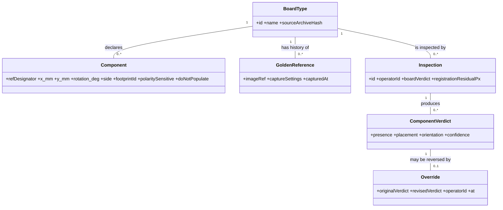

# GerberEye Domain

*Derived from: requirements.md §7 (glossary), functional-requirements.md (domain model, business rules), system-model.md §1.*

## Terms that are routinely confused — get these right

| Term | Precise meaning | Do not confuse with |
|---|---|---|
| **Gerber** | Vector description of PCB *layers* (copper, silkscreen, mask). RS-274X common; X2/X3 add metadata | Does **not** contain component placement — that is the pick-and-place file |
| **Pick-and-place file** | Per-component list: refdes, X, Y, rotation, side. **The single most important input** | "CPL", "centroid", "XY", `.pos` — all the same thing |
| **Reference designator** | Per-component label (`R12`, `C4`, `U3`). **The primary key of this entire domain** | Not the part number; not the footprint |
| **Fiducial** | Copper marker etched specifically as an optical alignment reference | Not a via, not a test point |
| **Golden board** | Known-correct assembled board used as the visual reference | Not the design file; the differencing path uses this *instead of* CAD |
| **DNP** | Do Not Populate — designator in the design, deliberately empty | **Reporting a DNP as "absent" is a guaranteed false call on every board of that type.** See BR + FR-002 |
| **False call** | Flagging a defect on a good board | Opposite of an *escape* (missing a real defect). Distinguish these two rigorously — they trade against each other |
| **AOI** | Automated Optical Inspection — assembly verification | Not AXI (X-ray), not SPI (paste), not ICT (electrical) |

**Assembly defects ≠ bare-board defects.** This project inspects *placed components* (absent, offset, rotated, reversed). It does **not** inspect copper traces (open, short, mousebite, spur). Most public PCB datasets solve the bare-board problem — they are the wrong problem here.

## Entities

Cardinalities that surprise people:
- `BoardType → GoldenReference` is **0..\*** not 1 — golden boards get damaged or superseded, so references are appended, never overwritten.
- `BoardType → Component` can be **zero** — a board type ingested without a pick-and-place file runs the differencing path only.
- `ComponentVerdict → Override` is **0..1** and the original is immutable. An override is a **new row**, never a mutation.

## Business rules — quote these, do not re-derive them

| ID | Rule | Volatility |
|---|---|---|
| **BR-01** | A component map entry is uniquely identified by refdes within a board type | Low |
| **BR-02** | Design coordinates in **millimetres**, origin at board lower-left, X right, Y up | Low |
| **BR-03** | ROI = package footprint extent × **1.20** | **High** |
| **BR-04** | Offset when centroid deviates > **25%** of the smaller package dimension | **High** |
| **BR-05** | Rotated when principal axis deviates > **15°** from nominal | **High** |
| **BR-06** | Board fails when ≥1 component is absent, offset, rotated, or reversed | Medium |
| **BR-07** | Confidence < **0.60** → mark `for-review`, do not assign a verdict | **High** |

**High-volatility rules live in the `thresholds` table, per board type — never as constants in code.** See ADR-004. If you find yourself typing `0.25` or `15` into a classifier, stop.

**BR-03/04/05/07 numbers are inferred starting values, not IPC-A-610 citations.** Do not present them as standards-derived (defect D-02).
