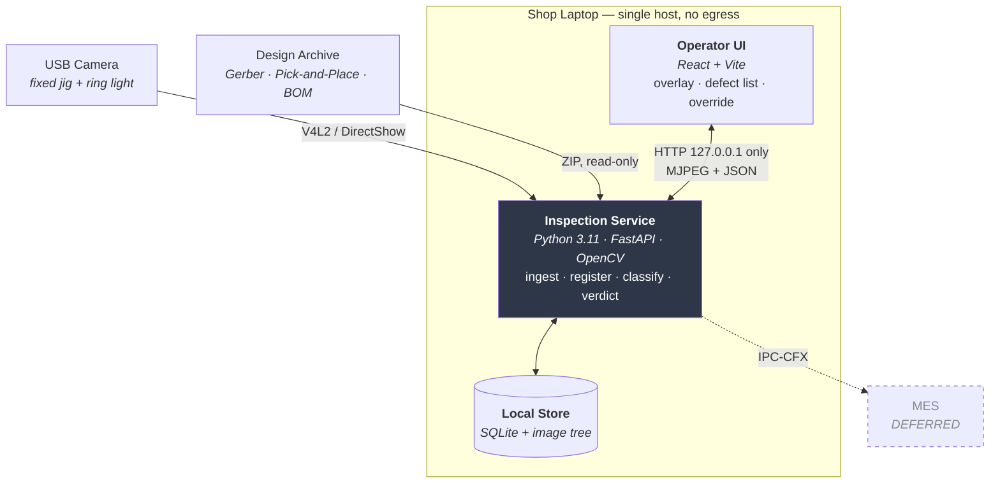

<div align="center">

# 🔍 GerberEye

### **Low-cost CAD-referenced optical inspection for PCB assembly**

**The design file already knows what should be on the board.**
**Nobody ever showed it to the camera.**


[The Problem](#-what-is-this) · [Two Paths](#-two-paths-one-verdict) · [How It Works](#-how-it-works) · [Architecture](#-architecture) · [Numbers](#-the-numbers) · [Decisions](#-decisions-already-settled) · [Docs](#-documentation-map) · [Status](#-status--open-items)

</div>

---

## ⚡ What is this?

An Indian MSME that assembles printed circuit boards inspects them **by eye**, under a magnifier lamp, against a **printed** assembly drawing. An operator mentally cross-references two hundred reference designators against paper, board after board, shift after shift. Accuracy falls off with fatigue and board density.

Commercial automated optical inspection (AOI) machines solve this. They also cost more than the shop earns in a year. There is no middle option between *a person squinting at a board* and *a machine costing ₹15–50 lakh*.

**GerberEye is the middle option.** A USB camera on a fixed jig, a ring light, and the laptop the shop already owns. Under ₹10,000 of hardware.

An operator places an assembled board. Within a few seconds the screen outlines every deviation from the design and **names it by reference designator** — `C14 missing`, `U3 rotated 180°` — and writes a permanent local record of the board.

> [!NOTE]
> **Documentation-first.** Eight phases of requirements, architecture, system modelling and validation are complete and lint-clean, alongside five [Claude Code skills](.claude/skills/) that carry the domain, pipeline, conventions, ADR format and testing strategy into every coding session. Implementation begins from this spec — today the repository is the design, not yet the build.

### The reframe that makes this work

> "MSMEs need a cheap AOI machine."
> → *Why?* They can't afford a commercial one.
> → *Why does that matter?* They're inspecting by eye and missing defects.
> → *Why are they missing defects?* A human cross-referencing 200 designators against paper is fatiguing and error-prone.
> → *Why is paper the reference?* **Because the design data already exists digitally — and is never connected to the inspection step.**

The real problem is a **broken link** between the design data the shop already owns and the moment it would be most useful. That reframing is why this is CAD-referenced inspection rather than "train a defect classifier" — and it is why the system **needs no labelled defect dataset at all**.

---

## 🔀 Two paths, one verdict

```
CAD path        Capture → Registration → ROI extraction → Classification ─┐
                                                                          ├→ Verdict
Differencing    Capture → Golden-board diff ────────────────────────────┘
```

| Path | Needs | Gives you |
|---|---|---|
| **A — Golden differencing** | One known-good board. No design files, no CV depth | The demo that cannot fail. Built first |
| **B — CAD registration** | Gerber + pick-and-place for the board in front of the camera | The differentiator: per-component, named, design-referenced verdicts |

The two paths have **different data prerequisites**, so no single blocker takes out both. Where a component map exists the CAD path runs and differencing does not. Both converge on one verdict stage that doesn't care which produced them — that convergence is what makes this a design decision rather than two parallel prototypes. See [ADR-002](docs/inception/adrs/ADR-002-two-path-inspection.md).

---

## 🧠 How it works

### 1. The pick-and-place file is the label source

A Gerber archive describes the board's **layers**. Its companion pick-and-place file describes the **components** — reference designator, X, Y, rotation, side, footprint. It states exactly what should sit at every coordinate on the board.

That single fact dissolves the machine-learning data problem:

- **No annotation is required to know ground truth.** The design file *is* the ground truth.
- **Defects can be seeded digitally.** Mask a component's region using its pick-and-place coordinate → `absent`. Affine-rotate it → `rotated`. Flip it → `reversed`. Hundreds of labelled instances from one board, in an afternoon.
- The pitch line: ***"we don't need annotated data — the design file is the label."***

### 2. Register design coordinates onto camera pixels

Detect fiducials (or the board outline) in the live frame, solve a homography, and every component's millimetre coordinate becomes a pixel region. Registration quality is a **first-class runtime value**, not an internal diagnostic:

| RMS residual | State | Behaviour |
|---|---|---|
| ≤ 2.0 px | `registered` | Normal operation |
| 2.0 – 5.0 px | `degraded` | Proceeds, and the inspection is marked degraded |
| > 5.0 px | `failed` | **Emits no verdicts at all.** Offers manual 4-point fallback |

Registration error propagates into every region. A 5 px error on an 0402 package is a large fraction of the component — it *manufactures* false calls at the smallest sizes.

### 3. Classify with classical features, not a neural net

Five outcomes per component: **present · absent · misaligned · rotated · polarity-reversed.**

The latency budget allows **~6 ms per component** on a CPU with no GPU. Template matching, edge density and colour statistics fit comfortably. A per-component CNN does not — and there is no public labelled assembly-defect dataset to train one on anyway (the well-known PCB datasets are *bare-board trace* defects, a different problem at a different manufacturing stage). See [ADR-003](docs/inception/adrs/ADR-003-classical-cv-hot-path.md).

### 4. The operator is the authority

A false call is worse than it sounds. The operator's threshold is *"if it cries wolf twice in a row I'll stop looking at it"* — so overriding a verdict is **one click**, and the override is an appended row, never a mutation of the original.

---

## 🏗 Architecture

A modular monolith on a single host, with a pipe-and-filter inspection pipeline. **The host boundary is the security boundary** — nothing crosses it.



### The stack

| Layer | Choice | Licence | Why |
|---|---|---|---|
| Language | Python 3.11 | PSF | The CV and Gerber ecosystems are Python-native |
| Vision | OpenCV | Apache-2.0 | `findHomography`, `matchTemplate`, ArUco — all first-class, all cheap on CPU |
| Gerber / PnP | `pygerber` (fallback `gerbonara`) | MIT / Apache-2.0 | Gerber X2/X3 with a rendering engine |
| API | FastAPI + Uvicorn | MIT | Fastest path to both JSON and a streaming endpoint |
| UI | React + Vite | MIT | Video via `` — no WebRTC, no frame marshalling |
| Store | SQLite (WAL) | Public domain | No server process to install on a shop laptop |
| Packaging | PyInstaller | Permissive for bundled output | One offline bundle, installed from a USB stick in ≤ 15 min |

**No GPU. No CUDA. No TensorRT. No cloud client library of any kind.**

### Three rules that are load-bearing

**1. Loopback only. Never `0.0.0.0`.**
An MSME's design files are *its customer's confidential IP*. Binding to all interfaces exposes them to the factory LAN. This is asserted by a test, not by code review — one character breaks the strongest claim the project makes.

**2. No AGPL or GPL in shipped dependencies.**
Ultralytics YOLO is AGPL-3.0 and is therefore **not** used — a deliberate rejection of the single most common stack choice in comparable projects, because an MSME deploying it would inherit a copyleft obligation. Every shipped component is MIT, Apache-2.0, BSD or public domain.

**3. Verdict tables are append-only.**
No update or delete exists for `inspection`, `component_verdict` or `override`. A correction is a new row. Retention deletes image *files* and nulls their paths; it never removes a record. That is the difference between an audit trail and a database that happens to contain history.

---

## 📐 The numbers

Every target below is stated against a **reference bench** — 4-core x86 laptop at ≥2.0 GHz, 8 GB RAM, no discrete GPU; 1080p USB camera with manual exposure/focus/white-balance; ≤250 components; fixed diffused ring light. Without the bench, the numbers would be unfalsifiable.

| | Metric | Target | Minimum |
|---|---|---|---|
| **NFR-001** | Trigger → defect list, p95 | **≤ 5.0 s** | ≤ 10.0 s |
| **NFR-002** | Resident memory / CPU | ≤ 2.0 GB · ≤ 80% of 4 cores | ≤ 3.5 GB |
| **NFR-004** | Recall on seeded defects | **≥ 90%** | ≥ 80% |
| **NFR-005** | False calls per component, good boards | **≤ 0.5%** | ≤ 1.0% |
| **NFR-006** | Registration RMS residual | ≤ 2.0 px | ≤ 5.0 px (degraded) |
| **NFR-007** | Untrained operator to first correct inspection | ≤ 5 min | — |
| **CON-02** | Additional hardware cost | **≤ ₹10,000** | hard constraint |

**Latency budget for the 5.0 s p95:**

```
  Frame capture + colour convert          100 ms
  Registration feature detection          300 ms
  Homography solve                         20 ms
  ROI extraction, 250 components          200 ms
  Classification, 250 components        1 500 ms   ← ~6 ms per component
  Verdict derivation + overlay render     300 ms
  Record persist                          200 ms
  ──────────────────────────────────────────────
  Allocated 2 620 ms · Reserve 2 380 ms · Total 5 000 ms
```

> **NFR-005 is the adoption metric, not the quality metric.** At 0.5% a 250-component board yields ~1.25 false calls; at 1.0%, 2.5. The minimum value sits exactly where operator trust starts to fail.

---

## 🚫 What this deliberately does *not* do

Half of a credible AOI project is knowing what a single top-down 2D camera physically cannot see.

| Anti-goal | Reason |
|---|---|
| Replace functional test or ICT | AOI verifies **placement**, not electrical function. A correctly-placed dead part passes AOI and must fail ICT |
| Inspect bare-board trace defects (open, short, mousebite, spur) | Different problem, different manufacturing stage. Most public PCB datasets solve *this* one — we deliberately don't |
| Grade solder joints to IPC-A-610 Class 3 | Needs 3D or X-ray. You cannot see under a BGA from above |
| Solder paste inspection (SPI) | Needs 3D height measurement |
| Verify component *values* (is that really 10 kΩ?) | Optically unreadable on small passives. That's what ICT is for |
| Be a cloud or multi-tenant SaaS | Contradicts the core constraint. **Local-first is the product, not a limitation** |
| Drive or actuate assembly machinery | We observe. We do not actuate |

---

## 🧭 Decisions already settled

Six ADRs. Four recurring proposals are **already decided** and reopening one requires meeting its stated *Revisit if* condition, not a preference.

| ID | Decision | Settles |
|---|---|---|
| [ADR-001](docs/inception/adrs/ADR-001-modular-monolith.md) | Modular monolith + pipe-and-filter pipeline | Why not microservices; why stages are separately testable |
| [ADR-002](docs/inception/adrs/ADR-002-two-path-inspection.md) | Two-path inspection | Why both paths exist; the forced build order |
| [ADR-003](docs/inception/adrs/ADR-003-classical-cv-hot-path.md) | Classical CV on the hot path | Why no CNN, no YOLO, and no labelled dataset needed |
| [ADR-004](docs/inception/adrs/ADR-004-per-board-type-thresholds.md) | Thresholds as per-board-type config | Why the tuning constants are not constants |
| [ADR-005](docs/inception/adrs/ADR-005-no-agent-framework.md) | No agent framework or LLM in the inspection path | Latency and egress reasoning |
| [ADR-006](docs/inception/adrs/ADR-006-permissive-licensing.md) | Permissive licensing only | Why not Ultralytics |

Already-settled: **adding a GPU/CUDA dependency · adding an agent framework · adding a cloud or hosted-model call · adding an AGPL library.**

The high-volatility thresholds — ROI scale ×1.20, offset >25%, rotation >15°, confidence floor 0.60 — live in a per-board-type `thresholds` table, never as constants in code. They are tuning defaults derived from the domain, refined per board type against measured results.

---

## 📚 Documentation map

| Document | What's in it |
|---|---|
| [docs/research.md](docs/research.md) | Landscape analysis: what actually wins SIH 2023–2025, and the scored selection of this problem statement out of 125 |
| [requirements.md](docs/inception/requirements.md) | Problem, goals, scope, 11 constraints, 8 assumptions, glossary, open questions |
| [stakeholder-register.md](docs/inception/stakeholder-register.md) | 14 stakeholders, including a negative stakeholder and two non-human ones, each with goals, pain points and an engagement plan |
| [functional-requirements.md](docs/inception/functional-requirements.md) | 27 FRs with flows, errors and acceptance criteria · 7 business rules · domain model · use cases |
| [nonfunctional-requirements.md](docs/inception/nonfunctional-requirements.md) | 13 NFRs, each with a metric, target, minimum, conditions and measurement method · ISO 25010 sweep · STRIDE pass |
| [system-model.md](docs/inception/system-model.md) | Logical data model, state machines, sequence diagrams |
| [architecture.md](docs/inception/architecture.md) | C4 diagrams, style comparison, stack rationale, ATAM-lite walkthrough, 8-item risk register |
| [traceability.md](docs/inception/traceability.md) | Forward and backward traceability, review techniques, logged defects |
| [_id-registry.md](docs/inception/_id-registry.md) | Append-only registry of every ID ever allocated |
| [.claude/skills/](.claude/skills/) | Five skills — domain, inspection pipeline, conventions, ADR format, testing — that load this context into a coding session |

---

## 📍 Status & open items

The inception set is complete and internally consistent — every requirement is testable, traced to a stakeholder, and clean against an automated form check. Implementation starts from here.

Two things are deliberately labelled rather than assumed:

- **Requirements are document-derived.** They come from the problem statement text, the IPC-A-610 defect taxonomy, competitive analysis of existing open-source AOI projects, and reasoning from the domain model. A visit to a local assembly shop is the next planned step and would ground the operator-facing detail further — roughly four hours of work, and the highest-leverage four hours available to the project.
- **The accuracy figures above are targets.** Recall and false-call rate are verified against the seeded-defect corpus, which is generated from pick-and-place coordinates in a single session. They are stated as targets until that run completes.

### Known risks, and what covers them

| | Risk | Mitigation |
|---|---|---|
| **RSK-01** | No matched CAD ↔ physical board pair in hand yet | The two-path design keeps a working demo independent of it; a matched pair is closed by fabricating one — a board built from files you uploaded matches those files by construction |
| **RSK-02** | Uncontrolled lighting shifts differencing and thresholds | Fixed jig, diffused ring light, locked exposure/focus/white-balance, and a measured frame-stability check *before* any threshold is tuned |
| **RSK-05** | No prior computer-vision experience on the team | Build order is forced — path A first, which needs no CV depth; registration is timeboxed with a mid-runway checkpoint |
| **RSK-07** | Hardware or bundle failure on demo day | Freeze and bundle 48 h early, rehearse on the demo machine, keep a known-good fallback path that cannot fail |

Every risk in the register carries a named owner and a dated action — see [architecture.md §11](docs/inception/architecture.md).

---

## 🗺 Deferred, with triggers

| Deferred | Trigger that forces it |
|---|---|
| Few-shot anomaly model (anomalib / PatchCore) | Measured false-call rate exceeds 1.0% after illumination is stabilised |
| IPC-CFX (IPC-2591) emission for MES integration | Advancing past the internal round — the Industry 4.0 credibility hook |
| Raspberry Pi as inference host (currently capture node) | A deployment target with no laptop appears |
| Multi-board panel support | A target board arrives panelised |
| Vernacular (Hindi / Tamil) operator UI | National finale |
| Operator authentication | An external audit requirement, or shared multi-operator shifts |

---

<div align="center">

**Context:** VITISH 2026 / SIH 2026 problem statement **#82 — Low-cost Optical Inspection for PCB Assembly**
Manufacturing · sponsor tag *Emerging Technologies Hackathon 2026* · SIH 2026 theme **Smart Automation**

*Every shipped dependency is MIT, Apache-2.0, BSD or public domain — so an MSME can deploy it without inheriting an obligation.*

</div>
