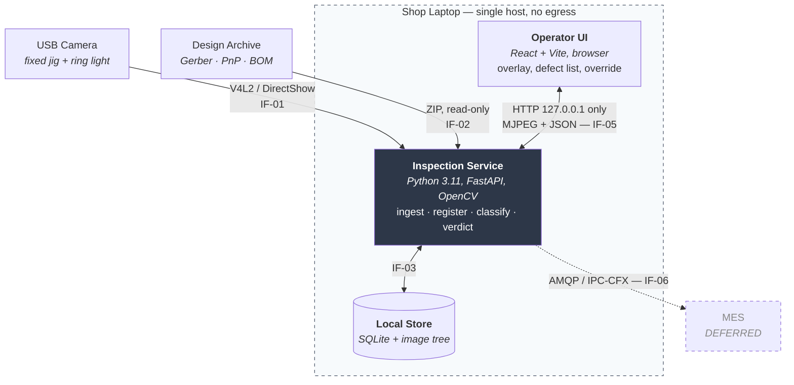
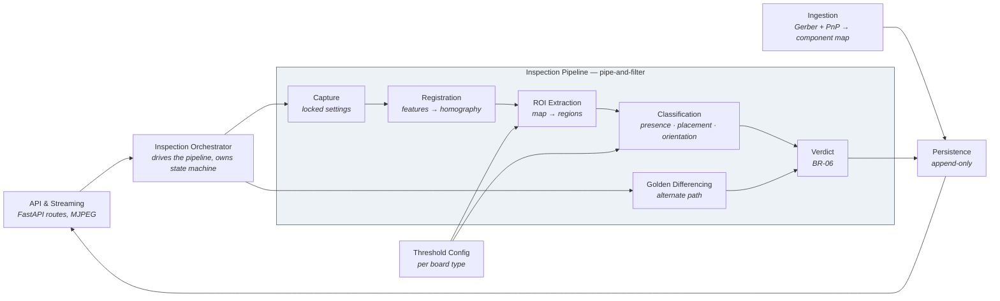
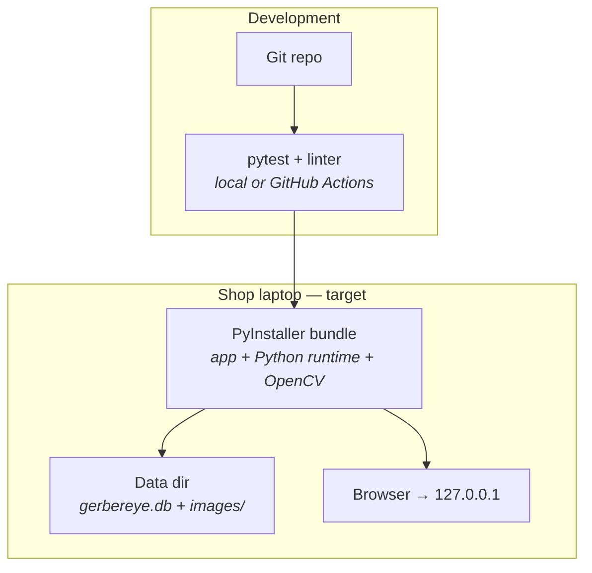

# Architecture Document — GerberEye

**Version:** 0.2 | **Phase 7** | **Status:** Draft | **Last updated:** 2026-08-14

---

## 1. Architectural Drivers

Restated from Phase 5. Every structural decision below traces to one of these; anything that doesn't is labelled a preference.

| # | Driver | Consequence |
|---|---|---|
| **D1** | **NFR-001** — inspection p95 ≤ 5.0 s, 250 components, CPU-only | Eliminates per-component deep inference. Determines the whole pipeline shape |
| **D2** | **CON-01 / NFR-011** — zero network egress; design files are customer confidential IP | Eliminates every cloud service, hosted model API, and licence check. Collapses the dependency graph to camera + local store |
| **D3** | **NFR-013** — thresholds changeable in ≤ 5 min, no rebuild | Forces configuration out of code into per-board-type records. Shapes the data model |
| **D4** | **NFR-005** — false calls ≤ 0.5% per component | Forces the override path into the core loop, and confidence into a first-class value |
| **D5** | **CON-03 / CON-04** — 2 weeks, 5 CSE + 1 ECE, no CV specialists | Forces a two-path design so a working demo exists independently of the differentiating feature landing |

> D5 is a legitimate architectural driver, not an excuse. An architecture this team cannot build, debug, and demo inside two weeks is not a safe choice regardless of its technical merit.

---

## 2. System Context (C4 Level 1)

See `requirements.md` §4. Unchanged: three human roles, design-data files in, camera in, local store, operator UI out, MES deferred.

---

## 3. Containers (C4 Level 2)

| Container | Responsibility | Technology |
|---|---|---|
| Operator UI | Render annotated stream, defect list, one-click override, setup flow | React + Vite; `` bound to MJPEG endpoint |
| Inspection Service | Everything else — ingestion, capture, registration, classification, verdict, persistence, streaming | Python 3.11, FastAPI, OpenCV, pygerber |
| Local Store | Board types, thresholds, golden references, inspections, verdicts, overrides, images | SQLite + filesystem image tree |

**The host boundary is the security boundary.** Nothing crosses it. IF-05 binds to `127.0.0.1`, never `0.0.0.0` — asserted by test, not by review.

---

## 4. Components (C4 Level 3) — Inspection Service

Two paths converge on `Verdict`: the CAD path (`REG → ROI → CLS`) and the differencing path (`DIFF`). Both produce component-or-region verdicts; `Verdict` is agnostic to which produced them. This convergence is what makes ADR-002's two-path strategy structural rather than a pair of parallel prototypes.

---

## 5. Architectural Style & Rationale

**Chosen: modular monolith, with pipe-and-filter applied to the inspection pipeline specifically.**

Scored against the drivers (`++` strong fit, `--` strong misfit):

| Style | D1 latency | D2 no-egress | D3 modifiability | D4 false calls | D5 team/time |
|---|---|---|---|---|---|
| **Modular monolith + pipe-and-filter pipeline** | `++` | `++` | `++` | `+` | `++` |
| Modular monolith, monolithic inspection function | `++` | `++` | `-` | `-` | `++` |
| Microservices (capture / register / classify separate) | `--` | `+` | `+` | `+` | `--` |
| Event-driven core | `-` | `+` | `+` | `+` | `-` |
| Agent-orchestrated (LLM framework driving the pipeline) | `--` | `--` | `+` | `-` | `--` |

**Why pipe-and-filter for the pipeline.** The inspection path is a fixed, acyclic sequence of transformations with no branching plan and no dynamic step selection. Pipe-and-filter matches that shape exactly: each stage is independently testable against recorded inputs, which is what makes the D4 accuracy work tractable — you can measure and tune registration error separately from classification error. A monolithic inspection function scores `-` on D3 because thresholds end up embedded in the same function that uses them.

**Why not microservices.** No driver requires independent deployability or independent scaling. There is one station, one operator, one board at a time. Distribution would add network hops directly into the D1 latency budget and operational complexity into the D5 runway, purchasing nothing. Recorded in ADR-001.

**Why not an agent framework.** Scored `--` on D1 and D2 and rejected. Full reasoning in ADR-005 — this is the most likely question a reviewer will ask, so it is recorded rather than left implicit.

**Layering within the monolith:** presentation (UI, API) → orchestration (Inspection Orchestrator) → domain (pipeline filters, verdict rules — no framework imports) → infrastructure (OpenCV capture, SQLite persistence, Gerber parsing). The domain layer holding no framework dependency is what delivers D3's 5-minute threshold change.

---

## 6. Cross-Cutting Concerns

| Concern | Decision |
|---|---|
| **Configuration** | Two tiers. Application config (paths, camera index, port) in a TOML file read at startup. **Classification thresholds per board type in the `thresholds` table**, loaded once per board-type load. Direct realisation of D3 — see ADR-004 |
| **Error handling** | Every pipeline stage returns a result carrying either an output or a typed failure. Parse and registration failures are **expected control flow**, not exceptions — FR-001 E1 and FR-008 E1 are normal states, and modelling them as exceptions is what produces crashes on malformed customer files |
| **Idempotency** | `startInspection` is guarded by the orchestrator state machine: a trigger arriving while not `Idle` is discarded (AC-017.3). One physical board yields exactly one inspection row |
| **Consistency** | Single-writer, single-process, local SQLite in WAL mode. Strong consistency throughout — the tradeoff that normally forces a choice here does not arise, because D2 removed every distributed component |
| **Observability** | Structured JSON lines to a size-capped local file (FR-027). Every inspection logs `registration_residual_px`, per-stage duration, and component count — the three fields needed to diagnose both D1 latency regressions and D4 accuracy regressions |
| **Caching** | Component map and thresholds cached in memory per loaded board type; invalidated on board-type switch. Frames are never cached. Golden reference image loaded once per board-type load |
| **Auth** | **None in MVP.** Operator identity is self-declared (OQ-09). Accepted gap, recorded as RSK-04 — a single-operator physical station on a shop floor has a physical access control model, but this does not satisfy external audit |
| **Versioning** | SQLite `schema_version` column, forward-only migrations. CSV export columns additive only, so an existing consumer's parser never breaks |

---

## 7. Technology Stack

| Layer | Selected | Licence | Rationale |
|---|---|---|---|
| Language | Python 3.11 | PSF | Team skill; the CV and Gerber ecosystems are Python-native |
| Vision | OpenCV (`opencv-python`) | Apache-2.0 | `findHomography`, `matchTemplate`, ArUco all first-class. low CPU cost, which D1 requires |
| Gerber / PnP | **pygerber** | **MIT** | Gerber X2/X3 with a rendering engine; X2 carries component metadata. `gerbonara` (Apache-2.0) is the fallback if X3 parsing proves incomplete |
| API | FastAPI + Uvicorn | MIT | Fastest Python path to both JSON and a streaming endpoint; team-familiar |
| UI | React + Vite | MIT | Team skill (D5). Video via `` — no WebRTC, no frame marshalling |
| Store | SQLite (WAL) | Public domain | Zero-configuration, single-file, and a direct fit for D2. No server process to install on a shop laptop |
| Packaging | PyInstaller | GPL **with commercial-use exception for bundled output** | Produces the single offline bundle that OQ-12 requires |
| Testing | pytest | MIT | Acceptance criteria in Phase 4 are written to be automatable |

**Deliberately rejected:**

| Rejected | Why |
|---|---|
| **Ultralytics YOLO** | **AGPL-3.0.** Violates CON-08 — an MSME deploying it would inherit a copyleft obligation. Also unnecessary under ADR-003. This is the single most common stack choice in comparable projects and rejecting it deliberately is a differentiator worth stating |
| PyQt6 | GPL / commercial dual licence. If a desktop shell is later wanted, use **PySide6** (LGPL) |
| anomalib / PatchCore | Excellent (Apache-2.0) and correct for the few-shot problem, but it is a **deferred** capability. Adding it inside D5's runway would consume the schedule with no MVP benefit |
| TensorRT / CUDA | No GPU exists (CON-05) |
| LangGraph / agent frameworks | ADR-005 |
| PostgreSQL | Requires a server process on a shop laptop; buys nothing at single-station scale |

Every shipped component is MIT, Apache-2.0, or public domain. **CON-08 is satisfied with no exceptions**, which is a defensible answer to a licensing question from an industry juror.

---

## 8. Data Architecture

Logical model in `system-model.md` §1. Physical mapping:

- **Single SQLite file** per installation, WAL mode for concurrent read during write.
- **Images on the filesystem**, paths in the database. Storing blobs inline would breach NFR-002's memory ceiling on read and make the FR-024 retention sweep a table rewrite.
- **No partitioning or sharding.** At one board per 10–60 s on a single station, volume does not approach any threshold that would justify it. Designing for scale that will not arrive buys complexity paid for daily.
- **Retention** deletes image files and nulls `region_path` / `image_path`; inspection and verdict rows are never removed (NFR-012).

---

## 9. Deployment View

- **Single environment.** No staging tier; the demo laptop is the target.
- **Rollback** = keep the previous bundle directory. The data directory is separate from the bundle, so a rollback never touches inspection records.
- **Install target** ≤ 15 min from a USB stick, no internet (OQ-12).
- **The demo bundle is built and tested on the demo machine at least 48 hours before the jury round.** This is a deployment requirement, not advice — RSK-07.

---

## 10. ADR Log

| ID | Decision | Status |
|---|---|---|
| [ADR-001](adrs/ADR-001-modular-monolith.md) | Modular monolith with pipe-and-filter inspection pipeline | Accepted |
| [ADR-002](adrs/ADR-002-two-path-inspection.md) | Two-path inspection: golden differencing + CAD registration | Accepted |
| [ADR-003](adrs/ADR-003-classical-cv-hot-path.md) | Classical CV on the hot path; no per-component deep inference | Accepted |
| [ADR-004](adrs/ADR-004-per-board-type-thresholds.md) | Classification thresholds as per-board-type configuration | Accepted |
| [ADR-005](adrs/ADR-005-no-agent-framework.md) | No agent framework or LLM in the inspection path | Accepted |
| [ADR-006](adrs/ADR-006-permissive-licensing.md) | Permissive licensing only; AGPL and GPL excluded from shipped code | Accepted |

---

## 11. Risk Register

| ID | Risk | Likelihood | Impact | Mitigation | Owner |
|---|---|---|---|---|---|
| **RSK-01** | No matched CAD ↔ physical board pair exists | **Certain today** | **High** — core mechanic undemonstrable on real hardware | Identify an open-hardware board already held, or buy one with published Gerbers (₹ negligible under CON-02). Two-path design (ADR-002) makes a demo possible regardless | ECE member — **Day 2** |
| **RSK-02** | Uncontrolled shop/room lighting breaks differencing and thresholds | High | High — false calls breach NFR-005 | Fixed jig + diffused ring light; lock capture settings (FR-006); bench-measure per-pixel variance (AC-006.2) before tuning anything else | ECE member — Day 4 |
| **RSK-03** | Target boards carry no detectable fiducials | Medium | High — registration fails, CAD path unusable | Board-outline corner fallback (FR-007); manual 4-point registration (FR-010) as last resort | Team — Day 3 |
| **RSK-04** | Self-declared operator identity gives no repudiation defence | Certain | Low (MVP) / High (real deployment) | Accepted for MVP. State the gap explicitly rather than implying an audit capability the system lacks | Team lead |
| **RSK-05** | Team has no prior computer-vision experience; homography and ROI work consumes the runway | **High** | **High** — nothing demonstrable at the gate | Build the differencing path first (it needs no CV depth), then layer registration. Timebox registration to 4 days; if unmet, demo path A and present path B on rendered Gerbers | Team lead — Day 8 checkpoint |
| **RSK-06** | No seeded-defect corpus exists in time, so NFR-004 recall cannot be claimed | Medium | Medium — accuracy claims become unevidenced | Build the corpus in the same session as the first golden capture. 10 boards × 5 seeded defects is one afternoon | Any member — Day 5 |
| **RSK-07** | Hardware or bundle fails on demo day | Medium | **High** — total loss at the gate | Freeze and bundle 48 h early; rehearse on the demo machine; record a backup video; hard-code a known-good board path that cannot fail | Team lead |
| **RSK-08** | Raspberry Pi used as a *networked* capture node, putting frames on the factory LAN | Low | **High** — breaches NFR-011, the strongest security claim | Default OQ-03 to laptop-attached USB camera for MVP. If a Pi is used, direct point-to-point link only, never a routed network | ECE member |

Every Medium-or-higher risk carries a named owner and a dated action. RSK-01, RSK-05 and RSK-07 are the three that decide whether this project reaches the jury with something working.

---

## 12. ATAM-lite — driver walkthrough

| Driver | Does the architecture satisfy it, or merely not violate it? | Risk | Sensitivity point | Tradeoff accepted |
|---|---|---|---|---|
| **D1** latency | **Satisfies.** Budget in NFR-001 allocates 1 500 ms to classify 250 components — ~6 ms per component, achievable with template matching and edge statistics on small ROIs. Pipe-and-filter allows per-stage measurement against the budget | Classification may exceed 6 ms/component on dense boards | **If component count rises above ~600, the budget fails** and ROI batching or downscaling becomes necessary | Accuracy ceiling — classical features will not match a tuned CNN on hard cases |
| **D2** no egress | **Satisfies structurally.** No network client library is a dependency. The only listener binds to loopback | A future contributor changes the bind address for convenience | **Bind address** — a one-character change flips compliance | No remote monitoring, no cloud dashboards, no fleet management |
| **D3** modifiability | **Satisfies.** Thresholds live in a per-board-type table read at board load; the domain layer imports no framework | Config could drift out of sync with code defaults | If thresholds needed to change *per component* rather than per board type, the table grows a dimension and the 5-min target is at risk | One-session-stale config: a threshold edit applies at next board load, not instantly |
| **D4** false calls | **Does not yet satisfy — it enables satisfaction.** Architecture makes confidence first-class and the override one interaction, but the actual rate is an empirical property of tuning, not of structure | Rate may not reach 0.5% within the runway | **Illumination stability** — RSK-02 dominates this number more than any algorithm choice | Recall traded against precision per defect class (T-01) |
| **D5** team/time | **Satisfies.** One language, one process, one datastore, no distributed components, no GPU toolchain, no model training in MVP | CV learning curve (RSK-05) remains the dominant schedule risk | **If registration is not working by Day 8**, path A alone must carry the demo | Deferred: ML path, IPC-CFX, Pi deployment, polarity refinement |

**Honest finding from this walkthrough:** D4 is the one driver the architecture *cannot* deliver on its own. Structure enables it; illumination discipline and empirical tuning determine it. That reframes RSK-02 from a hardware nuisance into the primary technical risk to the headline accuracy claim, and it is why the ring light and jig are not optional accessories.

---

## 13. Deferred Decisions

| Decision | Deferred because | Trigger that forces it |
|---|---|---|
| ML classifier (anomalib / PatchCore) | Classical CV meets D1 and D4 targets on in-scope classes; ML would consume the D5 runway | Measured false-call rate exceeds 1.0% after illumination is stabilised and thresholds tuned |
| IPC-CFX (IF-06) emission | No MVP stakeholder consumes it; deferred scope | Advancing past the internal round — it is the Industry 4.0 credibility hook for the national finale |
| Raspberry Pi as inference host | NFR-001 was derived on x86; Pi would require re-deriving it and would likely fail | A deployment target with no laptop appears |
| Operator authentication | Physical access control covers a single shop station | An external audit requirement, or multi-operator shifts sharing one station |
| Multi-board panel support | Single-board registration is less complex and demonstrates the mechanic fully | A target board arrives panelised |
| Desktop shell (PySide6) instead of browser UI | Browser is faster to build with team skills | Browser MJPEG latency measurably breaches D1 |

---

## 14. Feedback into earlier phases

Phase 7 surfaced items that were folded back:

- **NFR-011 was strengthened.** Originally framed as "works offline" (a cost/convenience property). The data-classification pass reframed it as *customer confidential IP must not leave the host* — a security property, and a materially stronger claim.
- **IF-05 bind address** was promoted from an implementation detail to a tested security assertion.
- **RSK-02 was upgraded** from a hardware nuisance to the primary risk against the headline accuracy NFR, following the ATAM walkthrough.
- **OQ-03 acquired a default** (laptop-attached USB camera) driven by RSK-08 rather than by convenience.

---

## 15. Exit criteria — Phase 7

- [x] Architectural drivers restated from Phase 5's top NFRs
- [x] C4 context, container, and component diagrams produced
- [x] Style chosen with a driver-scored comparison against 4 real alternatives
- [x] Cross-cutting concerns each decided once, centrally
- [x] Technology choices evaluated on fit-to-drivers and team fit; rejections recorded with reasons
- [x] ADRs written for all 6 contested or expensive-to-reverse decisions
- [x] Each top driver walked as a quality attribute scenario; one driver found **not** satisfiable by structure alone
- [x] Risk register has likelihood, impact, mitigation, and dated owner for all 8 risks
- [x] Deferred decisions listed with triggers
- [x] Discoveries folded back into earlier phases
