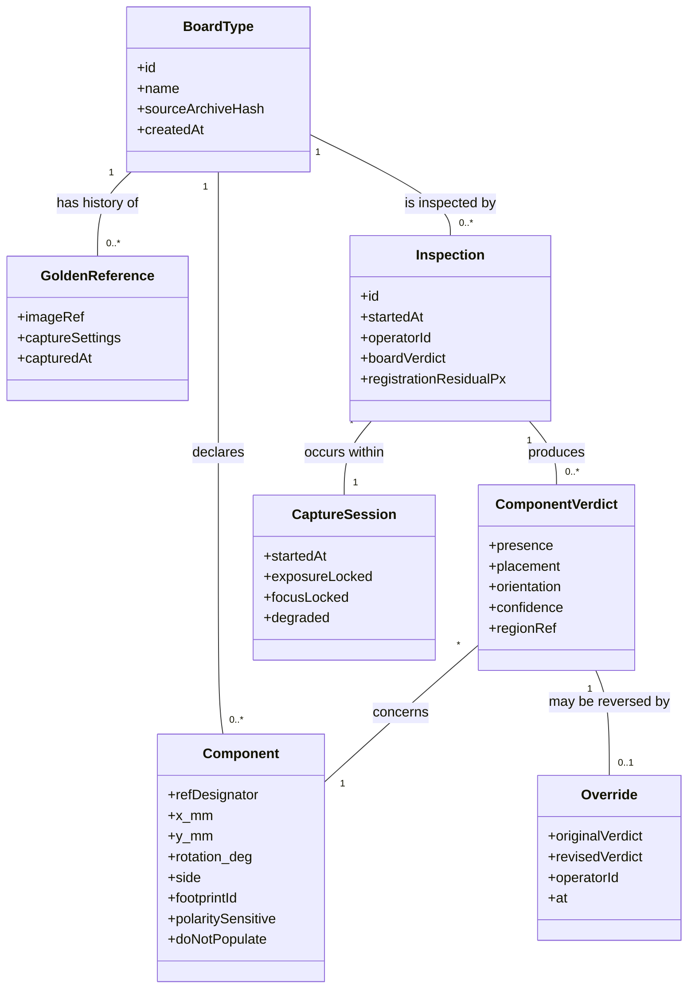
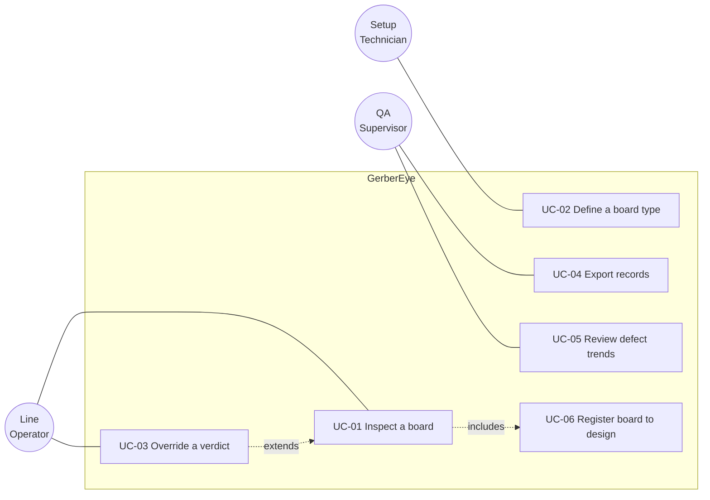
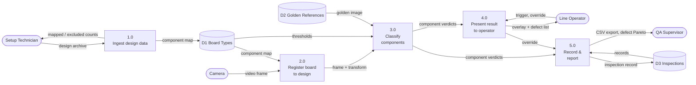

# Functional Requirements — GerberEye

**Version:** 0.2 | **Phases 3–4** | **Last updated:** 2026-08-14
**Organizing scheme:** by feature / capability, with an explicit cross-cutting section.

> **Elicitation note (Phase 3).** No stakeholder interviews were possible — see the proxy warning in `stakeholder-register.md`. Requirements below were derived by **document analysis** (PS #82 text, IPC-A-610 defect taxonomy, published SIH scoring criteria), **competitive analysis** (existing open-source AOI projects), and **reasoning from the domain model**. Techniques *not* used, and which would materially improve this catalog: contextual inquiry on a shop floor, operator observation, and a walkthrough with a QA supervisor. Requirements sourced only by inference are marked `[INFERRED]`.

> **Depth note.** FR-001, 006, 008, 011, 012, 018, 020 and 023 carry full detail (flows, errors, boundaries) because they are the architecturally significant or highest-risk behaviours. The remainder carry statement, trace, priority and acceptance criteria — never less, per the Phase 4 rules.

---

## A. Board Type Definition

### FR-001 — Ingest design data into a component map

- **Statement:** When the setup technician supplies a Gerber archive containing a pick-and-place file, the system shall produce a component map in which each entry holds a reference designator, an X coordinate, a Y coordinate, a rotation angle, a board side, and a package footprint identifier.
- **Trace to:** STK-103, STK-101
- **Priority:** Must
- **Source:** PS #82 text (explicit); `[INFERRED]` field list from pick-and-place format conventions
- **Actor:** Board-Type Setup Technician (STK-03)
- **Trigger:** Technician selects a design archive
- **Preconditions:** Archive is readable; a pick-and-place file is present
- **Postconditions:** A named board type exists in local storage containing the component map; source files are unmodified
- **Business rules:** BR-01, BR-02
- **Alternate flows:**
  - A1 — Archive contains no pick-and-place file → system reports the missing file type, offers golden-board-only mode (FR-005), board type is created without a component map
  - A2 — Pick-and-place uses an unrecognised column naming convention → system presents detected columns for manual mapping to the six required fields
  - A3 — Units are ambiguous between millimetres and inches → system infers from the Gerber unit declaration; where the Gerber is also ambiguous, system prompts the technician
- **Error handling:**
  - E1 — Gerber fails to parse → system reports the failing filename with the line number, retains any successfully parsed layers, does not create a partial board type
  - E2 — Duplicate reference designators in the pick-and-place file → system rejects the file and lists every duplicated designator
- **Acceptance criteria:**
  - AC-001.1 Given a valid archive containing 1 pick-and-place file with N component rows, when the technician ingests it, then the resulting component map contains exactly N entries.
  - AC-001.2 Given the same archive, each entry exposes a non-empty reference designator, a numeric X, a numeric Y, a numeric rotation in the range 0–360, a board side of `top` or `bottom`, and a footprint identifier.
  - AC-001.3 Given an archive whose pick-and-place file declares inches, when ingested, then all stored coordinates are in millimetres.
  - AC-001.4 Given an archive containing 2 rows with the reference designator `R1`, when ingested, then no board type is created and the error names `R1`.
  - AC-001.5 Given any successful ingestion, the SHA-256 of every source file after ingestion equals its value before ingestion.
- **Status:** Draft | **Verification:** Unit test on 3 published open-hardware archives + manual walkthrough

### FR-002 — Exclude do-not-populate designators
- **Statement:** The system shall exclude every designator marked do-not-populate from inspection.
- **Trace to:** STK-108 | **Priority:** Must | **Source:** `[INFERRED]` from domain (DNP is standard practice)
- **Rationale:** A DNP designator reported as a missing component is a guaranteed false call on every board of that type — the fastest possible route to operator distrust (STK-11).
- **Acceptance criteria:**
  - AC-002.1 Given a board type whose BOM marks `C7` as do-not-populate, when a board is inspected, then no result of any kind is emitted for `C7`.
  - AC-002.2 Given the same board type, the excluded designator count is displayed to the technician at setup.

### FR-003 — Identify polarity-sensitive components
- **Statement:** The system shall mark each component as polarity-sensitive or polarity-insensitive using its footprint identifier.
- **Trace to:** STK-102 | **Priority:** Should | **Source:** `[INFERRED]`
- **Acceptance criteria:**
  - AC-003.1 Given a component whose footprint identifier matches a two-terminal chip resistor pattern, then it is marked polarity-insensitive.
  - AC-003.2 Given a component whose footprint identifier matches a polarised electrolytic capacitor, a diode, or an integrated circuit pattern, then it is marked polarity-sensitive.
  - AC-003.3 Given a footprint identifier matching no known pattern, then it is marked polarity-sensitive, and the technician is shown the count of unmatched footprints.

### FR-004 — Persist a board type for reuse
- **Statement:** The system shall persist an ingested board type so that a subsequent inspection session reuses it without repeating ingestion.
- **Trace to:** STK-103 | **Priority:** Must
- **Acceptance criteria:**
  - AC-004.1 Given a board type ingested in a prior session, when the operator starts the application, then that board type is selectable without supplying design files.
  - AC-004.2 Given a persisted board type, its component map is byte-identical to the map produced at ingestion.

### FR-005 — Capture a golden board reference
- **Statement:** The system shall capture and store a reference image of a board that the technician confirms is correctly assembled.
- **Trace to:** STK-101, STK-103 | **Priority:** Must
- **Rationale:** Enables the differencing path (FR-015), which operates when no component map exists. This is the RSK-01 mitigation.
- **Acceptance criteria:**
  - AC-005.1 Given a board under the camera, when the technician confirms it as golden, then a reference image is stored against the board type.
  - AC-005.2 Given a stored golden reference, the capture settings used are stored alongside it.
  - AC-005.3 Given a board type with a stored golden reference, when the technician captures a replacement, then the previous reference is retained with its capture timestamp.

---

## B. Capture & Registration

### FR-006 — Acquire video under locked capture settings

- **Statement:** The system shall acquire video frames with exposure, focus, and white balance held at fixed values for the duration of an inspection session.
- **Trace to:** STK-116 | **Priority:** Must
- **Source:** STK-13 (non-human stakeholder needs)
- **Actor:** Capture Subsystem (STK-13)
- **Preconditions:** A camera is connected
- **Postconditions:** Frames are delivered at a stable rate with unchanging capture parameters
- **Rationale:** Auto-exposure and autofocus alter pixel values between frames, which destroys the comparability that both differencing (FR-015) and threshold-based classification (FR-012) depend on. This is a silent accuracy failure — the system appears to work while producing degraded results.
- **Alternate flows:**
  - A1 — Camera driver does not permit locking a given setting → system reports which settings could not be locked, continues, and marks every inspection in that session as degraded-confidence
- **Error handling:**
  - E1 — Camera disconnects mid-session → system halts inspection, displays a disconnection state, resumes on reconnection without losing the loaded board type
  - E2 — No camera present at startup → system starts in review-only mode with inspection disabled
- **Acceptance criteria:**
  - AC-006.1 Given a camera supporting manual control, when a session starts, then exposure, focus, and white balance report fixed values for the session duration.
  - AC-006.2 Given a static scene under constant illumination, when 100 consecutive frames are captured, then the mean per-pixel intensity variation across those frames is below 2 levels on an 8-bit scale.
  - AC-006.3 Given the camera is unplugged during a session, then inspection halts within 2 seconds and the loaded board type remains loaded.

### FR-007 — Detect registration features
- **Statement:** The system shall locate registration features in the captured frame, using board fiducials where the component map declares them and the board outline where it does not.
- **Trace to:** STK-101 | **Priority:** Must | **Source:** `[INFERRED]`; ASM-04
- **Acceptance criteria:**
  - AC-007.1 Given a board declaring 3 fiducials, when a frame is captured, then 3 candidate fiducial centres are returned with sub-pixel coordinates.
  - AC-007.2 Given a board declaring no fiducials, then 4 board-outline corner coordinates are returned.
  - AC-007.3 Given fewer detected features than the minimum of 4 point correspondences, then the system reports registration as failed rather than returning a low-quality result.

### FR-008 — Compute the design-to-pixel transform

- **Statement:** When registration features are detected, the system shall compute a homography mapping design coordinates to image pixel coordinates, and shall report the residual fit error.
- **Trace to:** STK-101, STK-103 | **Priority:** Must
- **Actor:** System | **Trigger:** Successful completion of FR-007
- **Preconditions:** At least 4 point correspondences between design coordinates and image coordinates
- **Postconditions:** A 3×3 transform exists for the current frame, with an associated RMS residual in pixels
- **Rationale:** This is the mechanic that distinguishes GerberEye from golden-board differencing. Its residual is the primary confidence signal for every downstream result.
- **Alternate flows:**
  - A1 — Board is placed rotated 180° in the jig → system detects the transform's rotation component, applies it, and continues without operator action
  - A2 — Residual exceeds the acceptance threshold → system re-attempts detection once, then falls back to FR-010
- **Error handling:**
  - E1 — Point correspondences are degenerate, meaning 3 or more are collinear → system reports registration as failed and names the cause
  - E2 — Transform implies a scale factor outside 0.5× to 2.0× of the expected value → system rejects it as a mis-detection rather than applying it
- **Acceptance criteria:**
  - AC-008.1 Given a board with 3 correctly detected fiducials, when the transform is computed, then RMS residual is at or below 2.0 pixels.
  - AC-008.2 Given a design coordinate for a known designator, when transformed, then the resulting pixel location falls within that component's visible extent in the frame.
  - AC-008.3 Given a board placed at 180° in the jig, then the transform is computed without operator intervention and AC-008.2 still holds.
  - AC-008.4 Given 3 collinear detected points, then the system reports failure and does not emit a transform.
  - AC-008.5 Given a computed scale factor of 3.0× the expected value, then the transform is rejected and registration reports failure.

### FR-009 — Report registration state to the operator
- **Statement:** The system shall display the current registration state as one of registered, degraded, or failed.
- **Trace to:** STK-107, STK-108 | **Priority:** Must
- **Acceptance criteria:**
  - AC-009.1 Given RMS residual at or below 2.0 px, then state displays as registered.
  - AC-009.2 Given RMS residual above 2.0 px and at or below 5.0 px, then state displays as degraded.
  - AC-009.3 Given registration failure, then state displays as failed and no component verdicts are shown.

### FR-010 — Manual registration fallback
- **Statement:** The system shall allow the operator to establish registration by selecting 4 points in the image that correspond to 4 known design coordinates.
- **Trace to:** STK-107 | **Priority:** Should | **Source:** ASM-04 mitigation
- **Acceptance criteria:**
  - AC-010.1 Given automatic registration has failed, when the operator selects 4 corresponding point pairs, then a transform is computed and inspection proceeds.
  - AC-010.2 Given a manual registration for a board type, when the next board of that type is inspected, then the prior manual correspondence is offered as the starting estimate.

---

## C. Inspection & Classification

### FR-011 — Extract per-component regions of interest

- **Statement:** When a transform exists, the system shall extract one image region per non-excluded component, sized from that component's package footprint with a fixed margin.
- **Trace to:** STK-102 | **Priority:** Must
- **Actor:** System | **Trigger:** Transform computed (FR-008) and inspection triggered (FR-021)
- **Preconditions:** Component map loaded; transform valid; component not excluded by FR-002
- **Postconditions:** One image region exists per inspected component, each tagged with its reference designator
- **Business rules:** BR-03
- **Alternate flows:**
  - A1 — A component's region falls partly outside the frame → system marks that component as not-inspectable rather than emitting a verdict from partial data
- **Acceptance criteria:**
  - AC-011.1 Given a component map with N non-excluded components fully inside the frame, then N regions are extracted.
  - AC-011.2 Given a component whose footprint is 3.2 mm × 1.6 mm and a fixed margin of 20%, then the extracted region covers 3.84 mm × 1.92 mm in design space.
  - AC-011.3 Given a component whose region extends beyond the frame boundary, then it is reported as not-inspectable and is excluded from the board verdict.

### FR-012 — Classify component presence

- **Statement:** For each extracted region, the system shall classify the component as present or absent.
- **Trace to:** STK-101, STK-102 | **Priority:** Must
- **Actor:** System
- **Preconditions:** Region extracted (FR-011)
- **Postconditions:** Each inspected designator carries a presence verdict with a confidence value in the range 0.0–1.0
- **Rationale:** Missing components are the highest-frequency assembly defect and the class most reliably detectable from a single top-down view.
- **Alternate flows:**
  - A1 — Confidence falls below the review threshold → component is marked for-review rather than being forced into present or absent
- **Error handling:**
  - E1 — Region is uniformly saturated, indicating a lighting failure → component is reported as not-inspectable, not as absent
- **Acceptance criteria:**
  - AC-012.1 Given a golden board with all components fitted, when inspected, then the count of designators classified absent is 0.
  - AC-012.2 Given a board from which exactly 3 components have been removed, when inspected, then those 3 designators are classified absent.
  - AC-012.3 Given the board in AC-012.2, then no designator other than those 3 is classified absent.
  - AC-012.4 Given a region whose pixels are uniformly at maximum intensity, then the designator is reported not-inspectable.
  - AC-012.5 Given any presence verdict, a confidence value in the range 0.0 to 1.0 accompanies it.

### FR-013 — Classify placement deviation
- **Statement:** For each component classified present, the system shall classify its placement as within tolerance, offset, or rotated.
- **Trace to:** STK-102 | **Priority:** Must | **Business rules:** BR-04, BR-05
- **Acceptance criteria:**
  - AC-013.1 Given a component displaced by more than 25% of its smaller package dimension, then it is classified offset.
  - AC-013.2 Given a component displaced by less than 10% of its smaller package dimension, then it is classified within tolerance.
  - AC-013.3 Given a component rotated more than 15° from its nominal angle, then it is classified rotated.
  - AC-013.4 Given a component rotated less than 5° from nominal, then it is classified within tolerance.

### FR-014 — Classify polarity orientation
- **Statement:** For each polarity-sensitive component classified present, the system shall classify its orientation as correct or reversed.
- **Trace to:** STK-102 | **Priority:** Should
- **Acceptance criteria:**
  - AC-014.1 Given a polarity-sensitive component mounted at its nominal rotation, then orientation is classified correct.
  - AC-014.2 Given a polarity-sensitive component mounted at nominal rotation plus 180°, then orientation is classified reversed.
  - AC-014.3 Given a polarity-insensitive component mounted at nominal rotation plus 180°, then no orientation verdict is emitted.

### FR-015 — Golden board differencing path
- **Statement:** When no component map exists for the loaded board type, the system shall report differing image regions between the captured board and the stored golden reference.
- **Trace to:** STK-101 | **Priority:** Must | **Source:** RSK-01 mitigation; conflict C-03
- **Rationale:** The independent baseline that works without design files and without a trained model. This path is the demonstration fallback that cannot fail.
- **Acceptance criteria:**
  - AC-015.1 Given a board type with a golden reference and no component map, when a board is inspected, then differing regions are reported with pixel coordinates.
  - AC-015.2 Given the golden board itself re-inspected, then the count of reported differing regions is 0.
  - AC-015.3 Given a board with 3 components removed relative to golden, then at least 3 differing regions are reported.
  - AC-015.4 Given a board type possessing both a component map and a golden reference, then FR-012 through FR-014 take precedence and this requirement does not execute.

### FR-016 — Derive a board verdict
- **Statement:** The system shall derive a board-level verdict of pass, fail, or review from the set of component verdicts.
- **Trace to:** STK-101 | **Priority:** Must | **Business rules:** BR-06
- **Acceptance criteria:**
  - AC-016.1 Given every inspected component is within tolerance, present, and correctly oriented, then the board verdict is pass.
  - AC-016.2 Given at least 1 component classified absent, offset, rotated, or reversed, then the board verdict is fail.
  - AC-016.3 Given no failing component but at least 1 component marked for-review or not-inspectable, then the board verdict is review.

---

## D. Operator Interaction

### FR-017 — Trigger an inspection
- **Statement:** The system shall begin an inspection when the operator issues a trigger action.
- **Trace to:** STK-104, STK-111 | **Priority:** Must
- **Acceptance criteria:**
  - AC-017.1 Given a loaded board type and a valid transform, when the operator triggers, then an inspection begins within 200 ms.
  - AC-017.2 Given no board type is loaded, when the operator triggers, then the system reports that a board type must be selected and begins no inspection.
  - AC-017.3 Given an inspection already running, when the operator triggers again, then exactly 1 inspection record is produced.

### FR-018 — Render the live overlay

- **Statement:** The system shall render the live camera frame with a visual marker at each inspected component's location, coloured by that component's verdict.
- **Trace to:** STK-101, STK-111, STK-112 | **Priority:** Must
- **Actor:** Line Operator (STK-01)
- **Preconditions:** Transform valid; inspection complete
- **Postconditions:** Operator can identify every failing component by looking at the screen alone
- **Rationale:** This is the entire user experience. Persona Ravi handles 100+ boards per shift with one hand on the board — the interaction budget is a glance.
- **Alternate flows:**
  - A1 — Component density makes markers overlap → system renders failing components above passing ones so failures are never occluded
- **Acceptance criteria:**
  - AC-018.1 Given an inspection with 3 failing components, then 3 markers are rendered in the failure colour at those components' transformed coordinates.
  - AC-018.2 Given the same inspection, each failing marker's centre falls within the corresponding component's visible extent.
  - AC-018.3 Given overlapping markers, then failing markers render above passing markers.
  - AC-018.4 Given a board verdict of pass, then the overlay presents a pass indication distinguishable without reading text.

### FR-019 — Present the named defect list
- **Statement:** The system shall present a list in which each entry names a reference designator and its defect type.
- **Trace to:** STK-102 | **Priority:** Must | **Source:** STK-05 (rework must not re-diagnose)
- **Acceptance criteria:**
  - AC-019.1 Given an inspection with a component `C14` classified absent, then the list contains an entry naming `C14` and the defect type absent.
  - AC-019.2 Given an inspection with 0 defects, then the list is empty and a pass state is shown.
  - AC-019.3 Given a list entry, when the operator selects it, then the corresponding overlay marker is highlighted.

### FR-020 — Override a result in one action

- **Statement:** The system shall allow the operator to reverse a single component's verdict with 1 interaction, and shall record the reversal against that inspection.
- **Trace to:** STK-107, STK-112 | **Priority:** Must
- **Actor:** Line Operator (STK-01)
- **Preconditions:** An inspection has produced at least 1 component verdict
- **Postconditions:** The component's verdict is reversed; the board verdict is recomputed; the original verdict is retained in the record
- **Rationale:** The trust mechanism, and the direct mitigation for the only opposed stakeholder (STK-11). Making a false call cheap to dismiss buys tolerance for a higher false-call rate than the raw number implies — see conflict C-01. Every override is also a labelled training example.
- **Alternate flows:**
  - A1 — Operator overrides the last remaining failure → board verdict recomputes to pass, and the record retains both verdicts
- **Acceptance criteria:**
  - AC-020.1 Given a component classified absent, when the operator overrides it, then exactly 1 interaction is required.
  - AC-020.2 Given the same, the inspection record contains the original verdict, the overridden verdict, and the operator identifier.
  - AC-020.3 Given a board with exactly 1 failing component, when that component is overridden, then the board verdict becomes pass.
  - AC-020.4 Given any override, the original captured region is retained in storage.

---

## E. Records & Reporting

### FR-021 — Persist an inspection record
- **Statement:** The system shall persist a record for every completed inspection containing a timestamp, a board type identifier, an operator identifier, a board verdict, and every component verdict.
- **Trace to:** STK-106 | **Priority:** Must
- **Acceptance criteria:**
  - AC-021.1 Given a completed inspection, then a record exists containing all 5 named fields.
  - AC-021.2 Given the application is terminated without warning immediately after an inspection completes, then that record is present on restart.
  - AC-021.3 Given a persisted record, then no operation exposed by the application modifies its verdict fields.

### FR-022 — Export inspection records
- **Statement:** The system shall export inspection records for an operator-selected date range as a comma-separated values file.
- **Trace to:** STK-106 | **Priority:** Must | **Source:** STK-06 audit expectation
- **Acceptance criteria:**
  - AC-022.1 Given 10 records within a selected range, then the exported file contains 10 data rows.
  - AC-022.2 Given a selected range containing 0 records, then an export is produced containing only a header row.
  - AC-022.3 Given an export, then it is written without any network access.

### FR-023 — Aggregate defects by designator
- **Statement:** The system shall report, for a selected board type, the count of failures per reference designator across a selected date range.
- **Trace to:** STK-109 | **Priority:** Should | **Source:** Meena's notebook workaround (persona STK-02)
- **Acceptance criteria:**
  - AC-023.1 Given 20 inspections in which `C14` failed 7 times, then the aggregate reports `C14` with a count of 7.
  - AC-023.2 Given the aggregate, then designators are ordered by failure count in descending order.

### FR-024 — Enforce a storage retention policy
- **Statement:** The system shall delete stored images older than a configured retention period while retaining their inspection records.
- **Trace to:** STK-115 | **Priority:** Should | **Source:** STK-14 (non-human)
- **Acceptance criteria:**
  - AC-024.1 Given a retention period of 90 days and an image 91 days old, when retention runs, then that image is deleted.
  - AC-024.2 Given the same, then the inspection record referencing that image remains present.
  - AC-024.3 Given a record whose image has been deleted, when it is viewed, then the absence of the image is stated rather than presented as an error.

---

## F. Cross-Cutting

### FR-025 — Operate without network access
- **Statement:** The system shall complete board type ingestion, inspection, override, and export with all network interfaces disabled.
- **Trace to:** STK-105, CON-01 | **Priority:** Must
- **Acceptance criteria:**
  - AC-025.1 Given every network interface is disabled, then FR-001, FR-012, FR-020, and FR-022 each satisfy their acceptance criteria.
  - AC-025.2 Given every network interface is disabled, then no operation blocks for longer than its stated latency budget while awaiting a network response.

### FR-026 — Protect ingested design files
- **Statement:** The system shall treat supplied design files as read-only.
- **Trace to:** STK-114 | **Priority:** Should
- **Acceptance criteria:**
  - AC-026.1 Given a design archive, when ingestion completes, then the SHA-256 of every file within it is unchanged.
  - AC-026.2 Given a design archive on read-only media, then ingestion completes without error.

### FR-027 — Log events for diagnosis
- **Statement:** The system shall write a local log entry for each of: board type ingestion, session start, registration failure, inspection completion, and override.
- **Trace to:** STK-113 | **Priority:** Should
- **Acceptance criteria:**
  - AC-027.1 Given each of the 5 named events occurs once, then the log contains 5 corresponding entries with timestamps.
  - AC-027.2 Given the log reaches its configured size ceiling, then the oldest entries are discarded and the newest are retained.

---

## Business Rules

| ID | Type | Statement | Source | Volatility | Used by |
|---|---|---|---|---|---|
| **BR-01** | Definition | A component map entry is uniquely identified by its reference designator within a board type | Domain | Low | FR-001, FR-004 |
| **BR-02** | Constraint | Design coordinates are stored in millimetres with the origin at the board's lower-left corner, X increasing right, Y increasing up | Gerber convention | Low | FR-001, FR-008 |
| **BR-03** | Derivation | A component's region of interest equals its package footprint extent scaled by 1.20 | `[INFERRED]` | **High** | FR-011 |
| **BR-04** | Constraint | A component is offset when its centroid deviates from nominal by more than 25% of its smaller package dimension | `[INFERRED]` from IPC-A-610 principles | **High** | FR-013 |
| **BR-05** | Constraint | A component is rotated when its principal axis deviates from nominal by more than 15° | `[INFERRED]` | **High** | FR-013 |
| **BR-06** | Inference | A board fails when at least 1 inspected component is absent, offset, rotated, or reversed | Domain | Medium | FR-016 |
| **BR-07** | Action enabler | A component whose classification confidence is below 0.60 is marked for-review rather than assigned a verdict | `[INFERRED]` | **High** | FR-012, FR-016 |

> **Volatility consequence for Phase 7.** BR-03, BR-04, BR-05 and BR-07 are all High volatility — these thresholds will be tuned repeatedly during bench testing and again per board type. **They must be configuration values, not constants in code.** A threshold change must not require a rebuild. This is an architectural requirement and it feeds directly into ADR-004.

---

## Domain Model



**Every `1` cardinality interrogated** — the exercise that surfaces hidden requirements:

| Relationship | Naive reading | Interrogated | Consequence |
|---|---|---|---|
| BoardType → GoldenReference | 1 golden board per type | **0..\*** — golden boards get damaged, lost, or superseded when a component is substituted | FR-005 must retain history, not overwrite (AC-005.3) |
| ComponentVerdict → Override | 1 override | **0..1**, and an override is never itself overridden — the original is immutable | FR-020 retains both verdicts (AC-020.2) |
| Inspection → BoardType | Always known | **1**, but only because FR-017 refuses to inspect without a loaded type (AC-017.2). Without that guard this would be `0..1` and every downstream aggregation would need null handling | Guard is load-bearing |
| Component → ComponentVerdict | 1 verdict per inspection | **0..\*** across inspections; **0..1** within one, since not-inspectable components emit none | FR-011 A1, FR-016 AC-016.3 |
| BoardType → Component | Every board has components | **0..\*** — a board type ingested via FR-001 A1 has *zero* components and runs the differencing path only | FR-015 AC-015.4 precedence rule exists because of this |

---

## Use Cases

### UC-01 — Inspect a board

```
Primary actor:      Line Operator (STK-01)
Scope:              GerberEye station
Level:              User goal
Stakeholders &      Operator      — wants a verdict in a glance, no false alarms
  interests:        QA Supervisor — wants no escapes and a durable record
                    Rework Tech   — wants the failing designator named
                    Manual Inspector — wants to remain the authority
Preconditions:      Board type loaded; capture session active; transform valid
Success guarantee:  Board verdict shown; inspection record persisted
Trigger:            Operator places a board and triggers inspection
Frequency:          100+ per shift  ← drives the near-zero-interaction design

Main success scenario
  1. Operator places the board in the jig.
  2. System detects registration features and computes the transform.
  3. Operator triggers inspection.
  4. System extracts a region per non-excluded component.
  5. System classifies presence, placement, and orientation per component.
  6. System derives the board verdict.
  7. System renders the overlay and the named defect list.
  8. System persists the inspection record.
  9. Operator removes the board.

Extensions
  2a. Registration fails
      2a1. System displays failed state and inspects nothing.
      2a2. Operator reseats the board. Return to 2.
      2a3. On repeated failure, operator invokes manual registration (FR-010).
  2b. Residual between 2.0 and 5.0 px
      2b1. System displays degraded state, proceeds, marks the record degraded.
  4a. Board type has no component map
      4a1. System runs the differencing path (FR-015) instead. Continue at 6.
  5a. A component region falls outside the frame
      5a1. System marks it not-inspectable; board verdict becomes review.
  5b. A region is uniformly saturated
      5b1. System marks it not-inspectable rather than absent.
  7a. Operator judges a flagged component to be correct
      7a1. Operator overrides in one action (FR-020).
      7a2. System recomputes the board verdict and records both verdicts.
  8a. Storage write fails
      8a1. System retains the record in memory, displays a storage warning,
           and retries. Inspection is not reported complete until persisted.

Special requirements: Steps 3-7 complete within 10 s (STK-104).
                      Operable with one hand (persona Ravi).
Open questions:       OQ-06 — does an override require a reason code?
```

### UC-02 — Define a new board type

```
Primary actor:      Board-Type Setup Technician (STK-03)
Level:              User goal
Frequency:          Once per board type — rare, but it is the adoption gate
Preconditions:      Technician holds the design archive for the board
Success guarantee:  A reusable board type exists, source files unmodified
Trigger:            A new product arrives on the line

Main success scenario
  1. Technician supplies the design archive.
  2. System parses the pick-and-place file into a component map.
  3. System marks do-not-populate designators as excluded.
  4. System classifies each component as polarity-sensitive or not.
  5. System reports counts: components mapped, excluded, footprints unmatched.
  6. Technician names and saves the board type.
  7. Technician places a known-good board and captures it as golden.

Extensions
  2a. No pick-and-place file present
      2a1. System offers golden-board-only mode; map is empty. Skip to 6.
  2b. Column naming unrecognised
      2b1. System presents detected columns for manual field mapping.
  2c. Units ambiguous
      2c1. System infers from the Gerber declaration, else prompts.
  2d. Duplicate designators present
      2d1. System rejects the file, lists every duplicate. Use case ends.
  4a. Footprints unmatched by the polarity classifier
      4a1. System defaults them to polarity-sensitive and reports the count,
           so the technician can judge whether the map is trustworthy.

Special requirements: Completes in under 5 min without training (STK-111).
                      This step is the reason CAD ingestion beats golden-only
                      teaching — it is the differentiator, in one use case.
```

### Use case diagram



---

## User Stories (MVP slice)

```
US-001  As a line operator,
        I want the screen to show me which components are wrong
        so that I do not have to read the assembly drawing.

  Given a board type with a component map and a correctly registered board
    And 3 components removed from the board
   When I trigger an inspection
   Then 3 markers appear in the failure colour on the live image
    And the defect list names those 3 reference designators
    And the board verdict shows fail
    And all of this occurs within 10 seconds of triggering

  Given a board with no defects
   When I trigger an inspection
   Then the overlay shows a pass state distinguishable without reading text

Size: L   Trace: STK-101, STK-102, FR-011, FR-012, FR-016, FR-018, FR-019
```

```
US-002  As a setup technician,
        I want to load a board's design files and have it become inspectable
        so that I do not have to teach the system component by component.

  Given a design archive containing a pick-and-place file with 120 rows
   When I ingest it
   Then a board type is created with 120 component entries
    And the count of excluded do-not-populate designators is shown to me
    And the source files are unchanged

  Given an archive with no pick-and-place file
   When I ingest it
   Then I am offered golden-board-only mode
    And no partial board type is created

Size: L   Trace: STK-103, FR-001, FR-002, FR-004
```

```
US-003  As a line operator,
        I want to dismiss a wrong result in one click
        so that a false alarm does not cost me time or force me to stop trusting it.

  Given an inspection flagged C14 as absent and C14 is in fact fitted
   When I override that result
   Then it takes exactly one interaction
    And the board verdict recomputes
    And the record retains both the original and the revised verdict

Size: M   Trace: STK-107, STK-112, FR-020
```

```
US-004  As a QA supervisor,
        I want to export what we inspected last month
        so that I can answer a customer audit with evidence.

  Given 40 inspections in the selected range
   When I export
   Then a CSV containing 40 data rows is written
    And it is produced with no network access

Size: S   Trace: STK-106, FR-022
```

**INVEST check:** US-001 is large but not splittable by layer without losing observable value; it splits legitimately by defect class — presence first (FR-012), then placement (FR-013), then polarity (FR-014). That is the recommended MVP split under CON-03.

---

## Data Flow Diagram — Level 1



**Balance check:** every process has both inputs and outputs — no black holes, no miracles. Data stores connect only to processes. Flows are labelled with data, not mechanism.

---

## Coverage Sweeps

| Sweep | Findings folded into the catalog |
|---|---|
| **CRUD** | Board type create (FR-001), read (FR-004), list — **gap: no board type delete or rename.** Logged as OQ-08 |
| **Lifecycle** | Inspection states: triggered → registered → classified → recorded. Illegal transition — trigger during a running inspection — handled by AC-017.3 idempotency |
| **Role** | Operator may override (FR-020) but may not delete a record (AC-021.3). Technician may create a board type. **No authentication model in MVP** — operator identity is a typed name. Logged as OQ-09 |
| **System lifecycle** | Day-one empty state: no board types exist. **Gap: first-run experience unspecified.** Logged as OQ-10 |
| **Failure** | Camera disconnect (FR-006 E1), no camera at startup (FR-006 E2), storage write failure (UC-01 8a), unparseable Gerber (FR-001 E1), saturated region (FR-012 E1), degenerate correspondences (FR-008 E1) |
| **Time** | Retention (FR-024). **Gap: inspection timestamps have no declared timezone handling.** Logged as OQ-11 |
| **Concurrency** | Single-station, single-operator by design. Two application instances against one datastore is **out of scope** — recorded here so the exclusion is deliberate rather than accidental |
| **Observability** | FR-027 logging; FR-023 defect aggregation; degraded-session marking (FR-006 A1) |

### New open questions raised by the sweeps
| ID | Question | Owner | Deadline | Default if unresolved |
|---|---|---|---|---|
| OQ-08 | Can a board type be deleted or renamed? | Team lead | Day 7 | No delete in MVP; rename allowed |
| OQ-09 | Is operator identity authenticated or self-declared? | Team lead | Day 7 | Self-declared typed name; external audit would require authentication (deferred) |
| OQ-10 | What does the operator see before any board type exists? | Team lead | Day 6 | Empty state directing to UC-02 |
| OQ-11 | Are timestamps stored in local time or UTC? | Any member | Day 6 | UTC stored, local displayed |

---

## Exit criteria — Phase 4

- [x] Every FR traces to at least one stakeholder requirement
- [x] Every FR has acceptance criteria covering happy path, alternates, errors, boundaries
- [x] No compound requirements, unquantified adjectives, or open-ended lists — *linter run pending in Phase 8*
- [x] Business rules catalogued separately with volatility noted; High-volatility rules flagged as configuration for Phase 7
- [x] Domain model agrees with the glossary; every `1` cardinality interrogated
- [x] All eight coverage sweeps run; 4 new open questions raised
- [x] Priorities assigned — 19 Must of 27 FRs (70%), justified below
- [x] Inferred requirements flagged `[INFERRED]`; unreachable sources flagged proxy

> **Must-have count note.** 70% Must exceeds the 60% guideline. This is deliberate and defensible: the MVP has already been cut to the minimum demonstrable system by conflict C-03, so what remains is largely irreducible. The Shoulds (FR-003, 010, 014, 023, 024, 026, 027) are the genuine deferral candidates. **If the two-week runway slips, cut FR-014 (polarity) and FR-023 (aggregation) first** — they are the highest-effort, lowest-demo-value items in the catalog.
