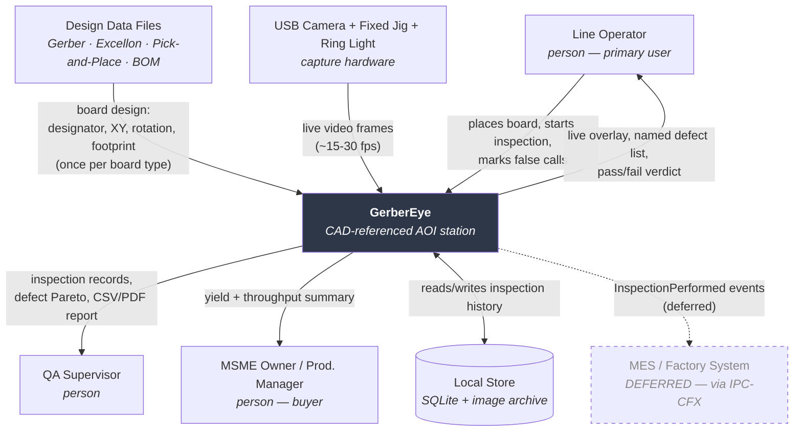

# Requirements Specification — GerberEye

**Low-Cost CAD-Referenced Optical Inspection for PCB Assembly**

**Version:** 0.3 (draft) | **Tier:** Standard | **Status:** Draft
**Problem statement:** VITISH 2026 / SIH 2026 PS #82 — *Low-cost Optical Inspection for PCB Assembly* (Manufacturing; sponsor tag *Emerging Technologies Hackathon 2026*)
**SIH 2026 theme mapping:** Smart Automation
**Last updated:** 2026-08-14

> **Notation:** Items marked `[ASSUMED]` were inferred, not confirmed by a stakeholder or a cited source. Every one has a matching row in §6 with a validation owner. Do not present an `[ASSUMED]` figure to a jury as fact until validated.

---

## 1. Problem Statement

**Who is affected**
Line operators and QA supervisors at Indian MSME printed-circuit-board assembly units — small shops running low-to-mid volume SMT and through-hole assembly, typically with hand-placement or a semi-automatic pick-and-place, and no automated inspection stage.

**What they are trying to do**
Confirm that every populated board matches its design — every component present, in the right place, right way round — before the board goes to functional test or ships to a customer.

**What blocks them today**
Inspection is done by eye, under a magnifier lamp, against a printed assembly drawing. The operator mentally cross-references hundreds of reference designators against paper. Accuracy degrades with fatigue, shift length, and board density. Commercial automated optical inspection (AOI) machines exist and solve this, but sit at a capital cost `[ASSUMED: ₹15–50 lakh — ASM-01]` that is out of reach for a shop of this size. There is no middle option between "a person squinting at a board" and "a machine costing more than the business earns in a year."

**Cost of the status quo**
Three costs, in descending order of what an MSME owner actually feels:
1. **Escaped defects** reach functional test or the customer, where diagnosis and rework cost far more than catching them at the assembly stage, and a customer-visible failure risks the contract.
2. **No inspection record.** When a customer asks "what did you check", the answer is a signature on a sheet. This blocks MSMEs from bidding on work that requires traceability.
3. **Inspection is the throughput bottleneck** on dense boards, and it is the one station that cannot be sped up by working harder.

**What "solved" looks like**
An operator places an assembled board under a fixed camera. Within a few seconds the screen shows the board with every deviation from the design outlined and named by reference designator — "C14 missing", "U3 rotated 180°". A record of every board inspected is kept locally and exportable. The whole station costs less than a week of the shop's revenue, needs no internet, and requires no training beyond "put the board here and look at the screen."

### Why-chain (recorded to keep the option space open)

> "MSMEs need a cheap AOI machine."
> → *Why?* Because they can't afford a commercial one.
> → *Why does that matter?* Because they're inspecting by eye and missing defects.
> → *Why are they missing defects?* Because a human cross-referencing 200 designators against a paper drawing is fatiguing and error-prone.
> → *Why is paper the reference?* Because the design data (Gerber, pick-and-place, BOM) exists in digital form but is never connected to the inspection step.

**The real problem is a broken link between design data the shop already owns and the inspection step where it would be most useful.** That reframing is what makes CAD-referenced inspection the right answer rather than "train a defect classifier" — and it is why this solution needs no labelled defect dataset (see §6, ASM-02).

---

## 2. Goals & Success Metrics

| Level | Statement | Metric | Baseline | Target |
|---|---|---|---|---|
| **Business** | An MSME can adopt automated inspection without capital approval | Total station cost | `[ASSUMED]` ₹15–50 L (commercial AOI) | **≤ ₹10,000** excl. existing laptop |
| **Business** | Inspection becomes auditable | % boards with a machine-generated inspection record | 0% | 100% of boards passed through the station |
| **User** | Operator identifies all deviations without consulting a drawing | Time from board placed to defect list shown | ~2–5 min manual `[ASSUMED: ASM-08]` | **< 10 s** |
| **User** | Operator needs no domain training to run it | Time to first correct inspection by an untrained user | n/a | **< 5 min** including setup |
| **System** | Register CAD to camera reliably | Registration success rate on in-scope boards | n/a | **≥ 95%** of frames, ≤ 2 px RMS fiducial error |
| **System** | Detect the in-scope defect classes | Recall on seeded defects / false-call rate | n/a | **Recall ≥ 90%, false calls ≤ 5%** per board |

### Anti-goals — what this system explicitly will *not* do

| Anti-goal | Reason |
|---|---|
| Replace functional test or in-circuit test (ICT) | AOI verifies *placement*, not *electrical function*. A correctly-placed dead part passes AOI and must fail ICT |
| Inspect bare-board / trace defects (open, short, mousebite, spur) | Different problem, different stage (fabrication, not assembly). Most public PCB datasets solve this — we deliberately do not |
| Grade solder joints to IPC-A-610 Class 3 | Requires 3D or X-ray. A single top-down 2D camera physically cannot see under a BGA |
| Solder paste inspection (SPI, pre-reflow) | Needs 3D height measurement |
| Be a cloud/multi-tenant SaaS | Directly contradicts CON-01. Local-first is the product, not a limitation |
| Drive or control assembly machinery | Out of scope; we observe, we do not actuate |

---

## 3. Scope

### In scope
- Ingest Gerber (RS-274X / X2), Excellon drill, and pick-and-place (CPL/centroid) files; derive a component map of reference designator → XY → rotation → package footprint
- Register that component map onto a live camera image of a physical board (fiducial/corner detection → homography)
- Per-component classification into: **present / absent / misaligned / rotated / polarity-reversed**
- Live operator overlay: video feed with pass/fail outlined per component, plus a named defect list
- Golden-board differencing as an independent baseline path that works without a trained model
- Local inspection record: per-board result, timestamp, operator, defect detail; CSV/PDF export
- Operator false-call marking (feedback captured for later model improvement)

### Out of scope (with reason)
| Excluded | Reason |
|---|---|
| BGA / hidden-joint inspection | Physically impossible with one top-down 2D camera — needs X-ray |
| Solder paste inspection | Needs 3D height data |
| Bare-board trace defect detection | Different manufacturing stage; see anti-goals |
| Component *value* verification (is that resistor really 10 kΩ?) | Unreadable optically on small passives; requires ICT |
| Automated rework or actuation | No mechanical capability in team (CON-04) |
| Multi-board panel handling | Deferred; single board simplifies registration for MVP |

### Deferred (with horizon)
| Deferred | Horizon |
|---|---|
| IPC-CFX (IPC-2591) message emission for MES integration | Post-internal round — this is the Industry 4.0 credibility hook for the national finale |
| Few-shot anomaly model (anomalib / PatchCore) for defect classes CAD cannot describe | Post-MVP, if labelled-data gap persists |
| Raspberry Pi standalone deployment (currently laptop-hosted) | Post-MVP; Pi is the capture node first, inference host later |
| Multi-angle / multi-camera capture for oblique defects | National finale |
| Vernacular (Hindi/Tamil) operator UI | National finale — pending ASM-05 |

### System boundary
- **System of record for:** inspection results, defect records, operator false-call feedback, the derived component map.
- **Caches / reads but does not own:** Gerber, pick-and-place, and BOM files. These are owned by the design/manufacturing process upstream. GerberEye must never be the only copy, and must never mutate them.
- **Delegates to external systems:** nothing in MVP. This is a deliberate consequence of CON-01.

---

## 4. Context Diagram

| Flow | Trigger | Payload | Volume |
|---|---|---|---|
| Design data → SYS | Operator loads a new board type | Gerber + PnP + BOM archive | Once per board *type* (rare) |
| Camera → SYS | Continuous | Video frames | 15–30 fps sustained |
| Operator → SYS | Per board | Place / trigger / mark-false-call | ~1 board per 10–60 s |
| SYS → Operator | Per frame | Overlay + defect list | Real-time |
| SYS → Store | Per board | Result record + defect crops | ~1 write/board |
| SYS → MES | Per board *(deferred)* | IPC-CFX `InspectionPerformed` | ~1/board |

---

## 5. Constraints

| ID | Category | Statement | Hard/Soft | Source |
|---|---|---|---|---|
| CON-01 | Technical / Environmental | The inspection path shall operate with **zero network dependency**. No cloud service, no API call, no licence check may sit between placing a board and seeing a result | **Hard** | PS #82 ("commodity hardware"); MSME shop-floor reality |
| CON-02 | Resource | Total additional hardware cost ≤ **₹10,000**, excluding a laptop the shop already owns | **Hard** | PS #82 ("cannot afford"); project positioning |
| CON-03 | Resource / Schedule | VITISH internal round deliverable due **within 2 weeks of 2026-08-14** | **Hard** | User |
| CON-04 | Resource / Skills | Team is **5 CSE + 1 ECE**. No mechanical fabrication capability; no machine shop | **Hard** | User |
| CON-05 | Technical | Compute is **commodity laptop CPU + Raspberry Pi**. No CUDA, no TensorRT, no discrete GPU | **Hard** | User |
| CON-06 | Technical | Capture device is a **USB webcam** (baseline). Microscope optics and controlled lighting are *not yet* procured | **Hard** (until procured) | User |
| CON-07 | Technical / Data | The team currently holds **physical PCBs without their design files**, and can obtain design files online **without the matching physical board**. No matched CAD↔board pair exists | **Hard** (blocking — see RSK-01) | User |
| CON-08 | Legal / Licensing | Components shipped in the deliverable should permit unrestricted commercial deployment by an MSME. **Avoid AGPL-3.0 and GPL-3.0** in shipped code | **Soft** (strong preference) | Product positioning; Ultralytics is AGPL-3.0 |
| CON-09 | Organizational | SIH team = **6 members, ≥1 female participant**, individual registration mandatory | **Hard** | SIH 2026 rules |
| CON-10 | Standards | Defect taxonomy should align to **IPC-A-610**; factory integration (deferred) should use **IPC-2591 (CFX)** | **Soft** | Industry credibility; jury recognition |
| CON-11 | Environmental | Shop-floor lighting is uncontrolled and variable; the station may sit near a window or under fluorescent tubes | **Hard** | Deployment reality — drives the fixed-jig + ring-light requirement |

**Hard vs soft, tested:** CON-08 is soft because violating it still produces a working hackathon demo — it only costs credibility under a specific jury question. CON-01 is hard because violating it destroys the entire value proposition, not merely a talking point.

---

## 6. Assumptions

| ID | Statement | Impact if false | Validation | Owner | Status |
|---|---|---|---|---|---|
| **ASM-01** | Commercial AOI capex is ₹15–50 lakh | The core cost argument collapses; need a new framing of "unaffordable" | Get one written quote or published price from an AOI vendor (Koh Young, Omron, Saki, or an Indian reseller) | Team lead | **Open — validate before pitching** |
| **ASM-02** | An MSME that *assembles* a board always possesses that board's Gerber and pick-and-place files, because they are required to manufacture it | Core premise fails — if shops lack design data, CAD-referenced inspection is unusable and golden-board differencing becomes the only path | Phone or visit any local PCB assembly shop; ask what files a customer sends with an order | ECE member | **Open — highest-value validation** |
| ASM-03 | A fixed jig + diffused ring light makes webcam images repeatable enough for golden differencing | Registration and differencing become unreliable; forces better optics (cost pressure on CON-02) | Bench test: 50 captures of the same board, measure pixel variance | Any member | Open |
| ASM-04 | Target boards have detectable fiducials, or a detectable rectangular board outline usable as a registration reference | Homography estimation fails; needs manual 4-point correspondence as fallback | Inspect the physical boards already held | ECE member | Open |
| ASM-05 | Operators can use an English UI | Needs vernacular UI, which is deferred scope | Ask a real shop | Team lead | Open |
| ASM-06 | A single top-down camera can detect every in-scope defect class (present/absent/misaligned/rotated/polarity) | Some classes need oblique views; scope must shrink | Bench test with seeded defects | Any member | Open |
| ASM-07 | Gerber + pick-and-place files for at least one **purchasable or already-owned** open-hardware board are obtainable | RSK-01 has no cheap mitigation; project must fall back to golden-board-only | Search open-hardware repos for a board matching one already held | Any member | **Open — blocking, do first** |
| ASM-08 | Manual inspection of a dense board takes ~2–5 minutes | The user-goal speed metric loses its baseline | Time an operator, or cite a published study | Team lead | Open |

> **Assumptions ASM-02 and ASM-07 have high impact and no completed validation. Both are promoted to the risk register below and both should be closed in week 1, not week 2.**

### Early risk — promoted from assumptions

**RSK-01 — No matched CAD ↔ physical board pair (severity: High, likelihood: Certain today)**

The project's differentiating mechanic is registering design data onto a photograph of the *same* board. The team holds boards without files, and can get files without boards. Until one matched pair exists, the core feature cannot be demonstrated on real hardware.

*Mitigation, in preference order:*

1. **Identify an open-hardware board the team already owns.** Many common dev boards (Arduino-family, ESP32 modules, Raspberry Pi HATs) publish Gerbers and pick-and-place files. Check the boards on hand against published open-hardware designs first — this costs nothing and closes the risk immediately if it hits.
2. **Buy one cheap open-hardware board whose design files are published.** Under CON-02's budget, an off-the-shelf dev board with public Gerbers is a rounding error.
3. **Two-path demo (fallback, and worth doing anyway).**
   - *Path A — physical, real:* golden-board differencing on the boards already held, with the component map defined semi-automatically from a golden photo. Proves the live camera pipeline end to end.
   - *Path B — CAD, proves the novel mechanic:* take a published design, render the Gerber to a synthetic board image, inject defects digitally using pick-and-place coordinates, and demonstrate CAD→ROI→overlay→classification on the render.
   - The two paths converge the moment one matched pair exists.
4. **Reframe honestly in the pitch.** Per ASM-02, a real MSME *always* has both the board and its files — they cannot manufacture otherwise. The team's mismatch is an artifact of being students, not a defect in the product concept. This is a good answer to a jury question, but only if ASM-02 is validated first.

---

## 7. Glossary

| Term | Definition | Synonyms / Notes |
|---|---|---|
| **AOI** | Automated Optical Inspection — camera-based verification of an assembled board | Distinct from AXI (X-ray) and SPI (paste) |
| **Gerber** | The de-facto standard vector file describing PCB layers (copper, silkscreen, soldermask). RS-274X is the common revision; X2/X3 add structured metadata | "Photoplot files", "fab files" |
| **Excellon** | Companion format describing drill hole positions and sizes | "Drill file", "NC drill" |
| **Pick-and-place file** | Per-component placement list: reference designator, X, Y, rotation, layer. **The single most important input to this system** | "CPL", "centroid file", "XY file", "`.pos`" |
| **BOM** | Bill of Materials — maps reference designator to part number and value | |
| **Reference designator** | The per-component label on a board (`R12`, `C4`, `U3`). The primary key of the domain | "RefDes", "designator" |
| **Fiducial** | A small copper marker etched on the board specifically as an optical alignment reference | "Fid", "alignment mark" |
| **Golden board** | A known-correct assembled board used as the visual reference for differencing | "Reference board", "master board" |
| **Homography** | The 3×3 projective transform mapping one plane to another — here, mapping design coordinates onto camera pixels | |
| **ROI** | Region of Interest — the cropped image patch corresponding to one component | |
| **Tombstoning** | A two-terminal part standing on one end, lifted off one pad | "Manhattan effect", "drawbridging" |
| **Billboarding** | A chip component mounted on its side rather than flat | |
| **Skew** | A component rotated or offset from its intended placement | "Misalignment", "misregistration" |
| **Polarity reversal** | A directional part (diode, electrolytic cap, IC) mounted 180° from correct orientation | "Reversed", "wrong polarity" |
| **Solder bridge** | Unintended solder connecting two adjacent pads | "Short", "bridging" |
| **SMD / SMT** | Surface-Mount Device / Technology — components soldered onto pads on the board surface | |
| **THT** | Through-Hole Technology — component leads pass through drilled holes | "Through-hole" |
| **DNP** | Do Not Populate — a designator present in the design but deliberately left empty. **Must not be reported as a missing-component defect** | "DNI", "NoPop" |
| **Silkscreen** | The printed legend layer showing outlines and designators | "Legend layer", "overlay" |
| **Panel** | Multiple copies of a board manufactured as one sheet, separated after assembly | "Array", "biscuit" |
| **IPC-A-610** | The industry standard defining acceptability of electronic assemblies — the source of the defect taxonomy | |
| **IPC-2591 / CFX** | Connected Factory Exchange — the IPC standard for machine-to-machine communication in electronics assembly. The Industry 4.0 integration path | "CFX" |
| **False call** | An inspection result flagging a defect where the board is actually good. The metric that determines whether operators trust the system | "False positive", "escape" is the opposite |

---

## 8. Stakeholders
See `stakeholder-register.md`.

## 9. Functional Requirements
*Phase 4 — in progress.*

## 10. Business Rules
*Phase 4 — in progress.*

## 11. Use Cases / User Stories
*Phase 4 — in progress.*

## 12. Non-Functional Requirements
*Phase 5 — pending.*

## 13. Open Questions

| ID | Question | Owner | Deadline | Default if unresolved |
|---|---|---|---|---|
| OQ-01 | Which specific physical board becomes the reference target? | ECE member | Day 2 | Buy an open-hardware dev board with published Gerbers |
| OQ-02 | Is a USB microscope + ring light within budget and procurable in time? | Team lead | Day 3 | Proceed with plain webcam; accept lower small-passive accuracy |
| OQ-03 | Does the Raspberry Pi act as capture node or inference host? | ECE member | Day 5 | Capture node only; laptop hosts inference (lowest risk under CON-03) |
| OQ-04 | Do we demo THT, SMD, or both? | Team lead | Day 3 | SMD only — denser, more impressive, and where AOI has real value |
| OQ-05 | Is there a reachable local PCB assembly shop for ASM-02 validation? | ECE member | Day 4 | Cite published industry practice instead; mark as unvalidated in the pitch |

## 14. Traceability Matrix
*Phase 8 — pending.*

## 15. Sign-off
| Artifact | Approver | Approved | Date |
|---|---|---|---|
| Phase 1 — Discovery | Team lead | ☐ | |
