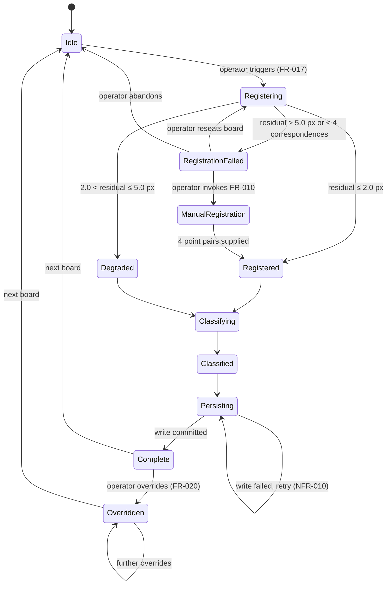
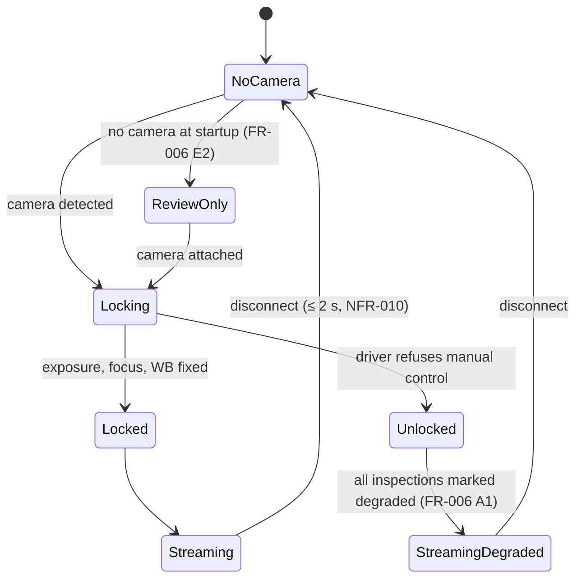
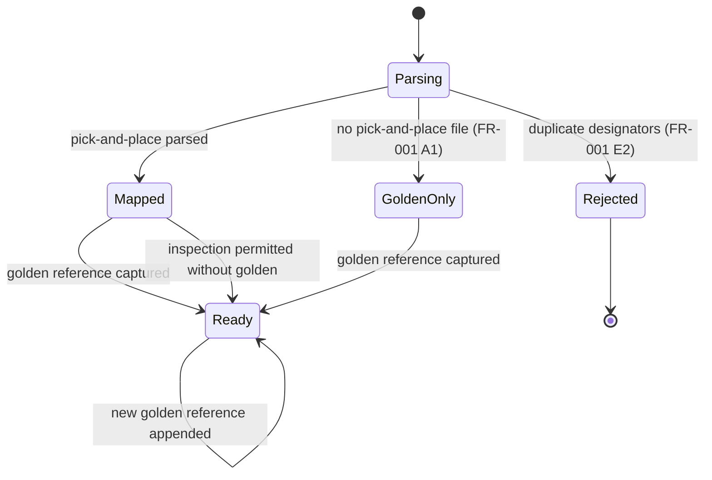
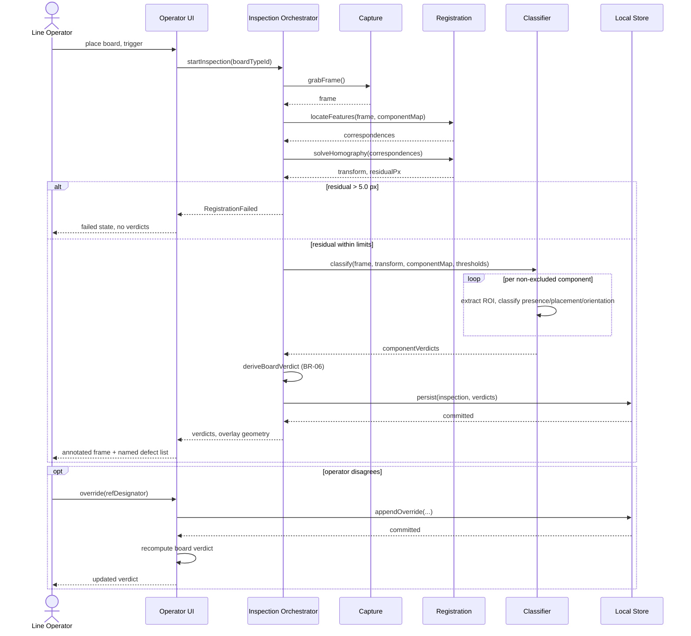
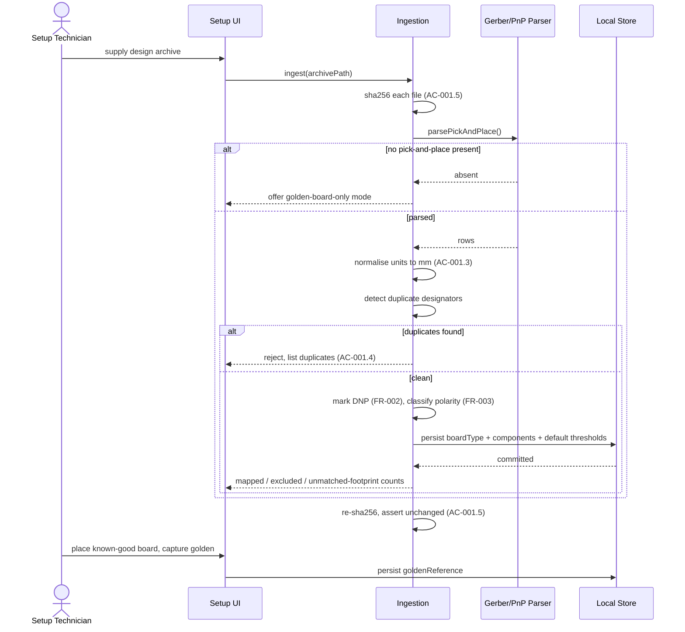

# System Model — GerberEye

**Version:** 0.1 | **Phase 6** | **Last updated:** 2026-08-14

---

## 1. Logical Data Model

Physical mapping to SQLite. Images are stored on the filesystem with paths held in the database — storing multi-megabyte blobs inline would defeat NFR-002's memory ceiling and complicate the retention sweep (FR-024).

| Entity | Key attributes | Consistency | Notes |
|---|---|---|---|
| `board_type` | `id`, `name`, `source_archive_sha256`, `created_at` | Strong | Immutable after creation except `name` |
| `component` | `board_type_id`, `ref_designator`, `x_mm`, `y_mm`, `rotation_deg`, `side`, `footprint_id`, `polarity_sensitive`, `dnp` | Strong | Composite PK `(board_type_id, ref_designator)` — enforces BR-01 at the schema level, so FR-001 E2 is a constraint violation rather than application logic |
| `thresholds` | `board_type_id`, `roi_scale`, `offset_pct`, `rotation_deg`, `confidence_floor` | Strong | **Per board type, not global** — this table is the physical realisation of NFR-013 |
| `golden_reference` | `id`, `board_type_id`, `image_path`, `capture_settings_json`, `captured_at` | Strong | Append-only; supersession by recency, never by overwrite (AC-005.3) |
| `inspection` | `id`, `board_type_id`, `operator_id`, `started_at`, `board_verdict`, `registration_residual_px`, `degraded` | **Append-only** | NFR-012 — no update path exists |
| `component_verdict` | `inspection_id`, `ref_designator`, `presence`, `placement`, `orientation`, `confidence`, `region_path` | **Append-only** | Composite PK `(inspection_id, ref_designator)` |
| `override` | `inspection_id`, `ref_designator`, `original_verdict`, `revised_verdict`, `operator_id`, `at` | **Append-only** | A correction is a *new row*, never a mutation. This is what makes NFR-012 structurally true rather than merely policy |
| `event_log` | `at`, `kind`, `detail_json` | Append-only, size-capped | FR-027 |

**Append-only is enforced structurally, not by convention.** The persistence layer exposes no update or delete operation for verdict tables. Retention (FR-024) deletes *image files* and nulls their path column; it never removes an inspection row. This is the difference between an audit trail and a database that happens to contain history.

---

## 2. State Machines

### Inspection lifecycle

**Load-bearing details.** `Persisting → Complete` occurs only on a committed write — this is what delivers NFR-009's RPO of one inspection. `Overridden` is reachable only from `Complete`, so an override can never race an in-flight classification. Self-loop on `Overridden` permits multiple corrections while each remains an appended row.

### Capture session

### Board type

> `GoldenOnly → Ready` is the **RSK-01 escape hatch**. A board type with no design files still reaches an inspectable state via the differencing path. This single transition is why the project has a demonstrable outcome even if no matched CAD↔board pair is obtained.

---

## 3. Sequence Diagrams

### UC-01 — Inspect a board (main success scenario)

**Note the ordering:** persistence completes *before* the UI reports the result. Reversing these two would make the display faster and would silently break NFR-009 — the operator would see a verdict for a board whose record does not exist.

### UC-02 — Define a board type

---

## 4. Interface Catalog

| ID | Interface | Direction | Protocol / Format | Volume | Failure mode | Versioning |
|---|---|---|---|---|---|---|
| **IF-01** | Camera | Inbound | V4L2 / DirectShow via OpenCV `VideoCapture` | 15–30 fps | Disconnect → NoCamera state ≤ 2 s (NFR-010) | Device-dependent; capability probe at session start |
| **IF-02** | Design archive | Inbound | ZIP containing Gerber RS-274X, Excellon, pick-and-place CSV/TXT | Once per board type | Unparseable → GoldenOnly path | Gerber X2 preferred; RS-274X accepted; column mapping fallback for unknown PnP dialects |
| **IF-03** | Local store | Bidirectional | SQLite file + filesystem image tree | ~1 write/board | Write failure → retry, inspection not reported complete | Schema version column; forward-only migrations |
| **IF-04** | Record export | Outbound | CSV (UTF-8, RFC 4180) | On demand | n/a — local file write | Column set is additive only |
| **IF-05** | Operator UI | Bidirectional | HTTP on `127.0.0.1` only; MJPEG stream + JSON | Continuous | Browser closed → inspection unaffected | Loopback bound; **never** `0.0.0.0` — that would breach NFR-011 |
| **IF-06** | MES via IPC-CFX | Outbound | AMQP 1.0, IPC-2591 message schema | ~1/board | **DEFERRED** — not in MVP | CFX v2.0, SDK backward-compatible |

**IF-05 is a security boundary, not merely a transport choice.** Binding the local HTTP server to `0.0.0.0` instead of `127.0.0.1` would expose a shop's customer design files to the factory LAN. That single default is the difference between satisfying and violating NFR-011, and it must be asserted in a test, not left to a reviewer's attention.

---

## 5. Exit criteria — Phase 6

- [x] Logical data model mapped to physical storage, with consistency class per entity
- [x] State machines for all three stateful entities; illegal transitions absent by construction
- [x] Sequence diagrams for the two primary use cases, including the failure branch
- [x] Interface catalog with direction, format, volume, failure mode, and versioning per interface
- [x] Append-only enforcement located in the schema and persistence layer, not in convention
